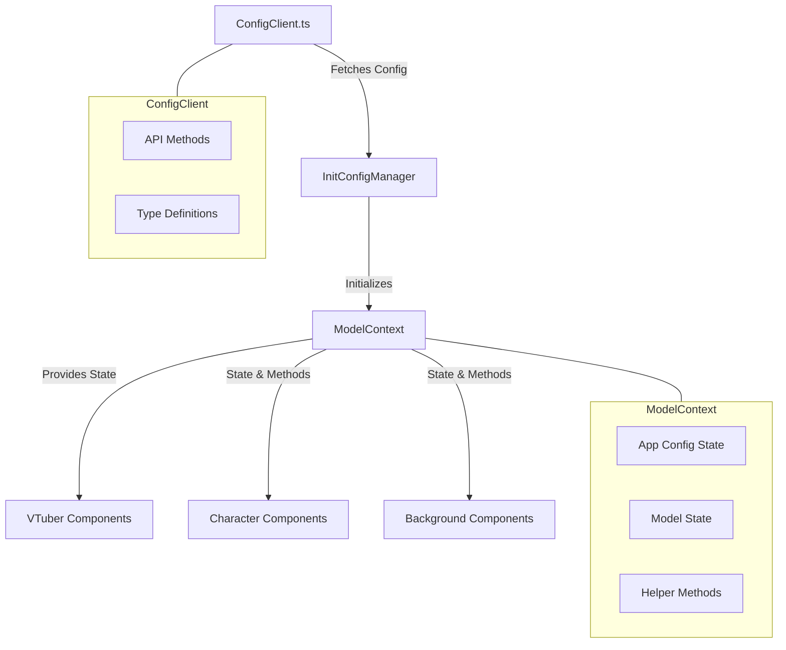
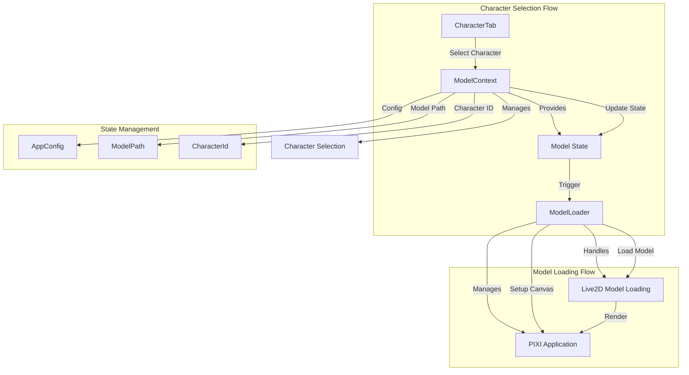
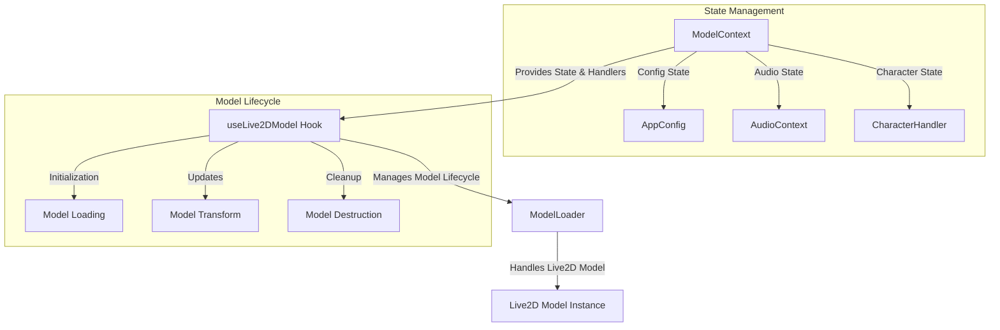
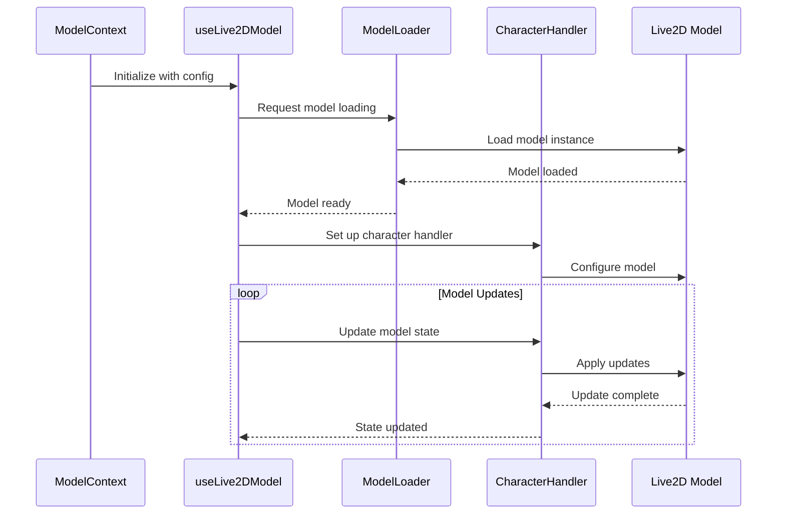
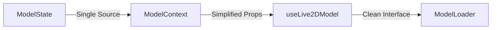
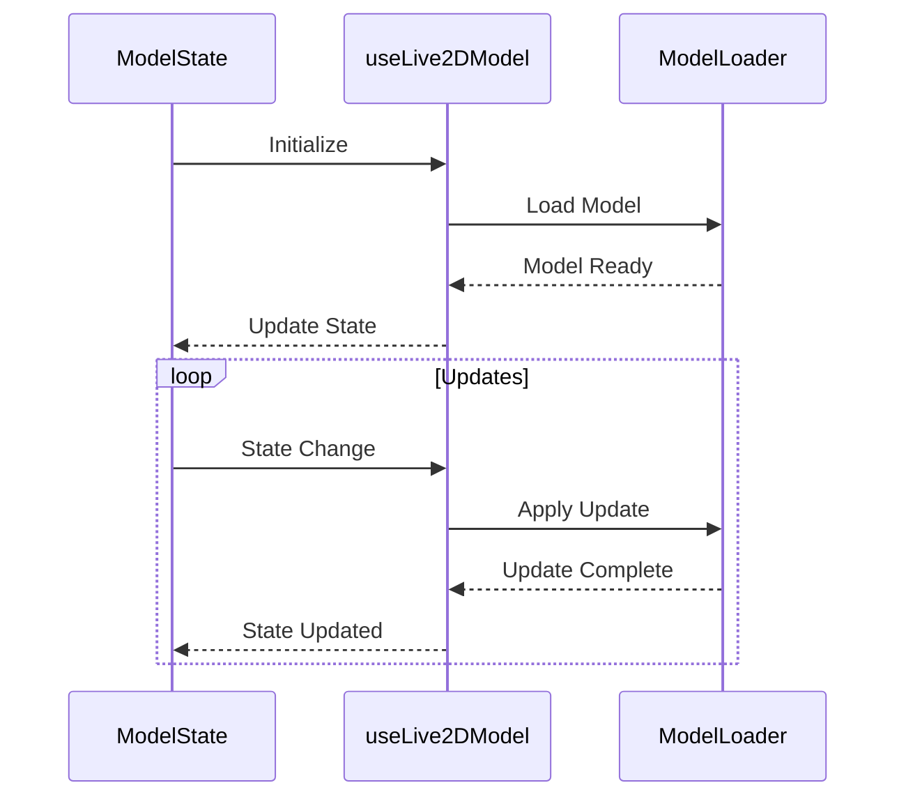
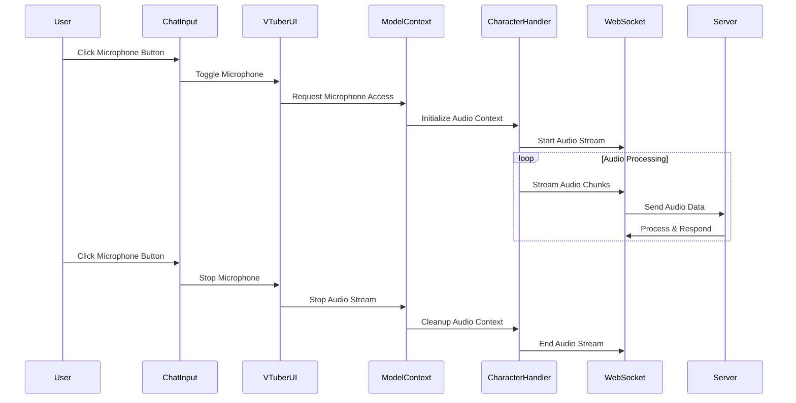

# AIdol-Vtuber Architecture Documentation

This document provides detailed architecture information for the AIdol-Vtuber platform.

## Table of Contents

- [State Management](#state-management)
- [Model Management Flow](#model-management-flow)
- [Live2D Model State Management](#live2d-model-state-management)
- [Microphone Audio Streaming System](#microphone-audio-streaming-system)

---

## State Management

### Architecture Overview

The VTuber app uses a centralized state management approach with React Context. The main state is managed by `ModelContext`, while configuration fetching is handled by `ConfigClient`.



### State Management Flow

1. **Initial Load**:
   - `InitConfigManager` fetches base configuration using `ConfigClient`
   - Configuration is passed to `ModelContext`
   - `ModelContext` becomes the source of truth for app state

2. **State Updates**:
   - Components receive state and update methods from `ModelContext`
   - All state modifications go through `ModelContext`
   - External API calls remain in `ConfigClient`

3. **Helper Methods**:
   - Utility functions like `findModelByName` and `findCharacterById` moved to `ModelContext`
   - These methods operate on the stored state

### Type Structure

```typescript
// Core state interfaces in ModelContext
interface ModelContextState {
  config: AppConfig;
  modelPath: string;
  characterId: string;
  backgroundPath: string;
}

// Methods provided by context
interface ModelContextValue extends ModelContextState {
  handleCharacterChange: (characterId: string, modelPath: string) => void;
  handleBackgroundChange: (backgroundPath: string) => void;
  findModelByName: (name: string) => Model | undefined;
  findCharacterById: (id: string) => Character | undefined;
}
```

### Key Components

- **ModelContext**: Central state management
- **ConfigClient**: External API communication
- **InitConfigManager**: Configuration initialization
- **VTuber Components**: State consumers

---

## Model Management Flow

### Architecture Overview

The VTuber app uses a centralized model loading system with character selection managed through context. Here's how the components interact:



### Component Responsibilities

#### ModelContext
- Manages character selection state
- Provides character selection methods
- Maintains model configuration
- Triggers model loading through state changes

#### ModelLoader
- Handles Live2D model initialization
- Manages PIXI application lifecycle
- Handles model loading/unloading
- Manages model positioning and scaling

#### CharacterTab
- Displays available characters
- Handles character selection UI
- Triggers character changes through context

### State Flow

1. **Character Selection**:
   ```
   CharacterTab
   └── Select Character
       └── ModelContext
           └── Update State
               └── ModelLoader
                   └── Load New Model
   ```

2. **Model Loading**:
   ```
   ModelLoader
   ├── Unload Current Model
   ├── Cleanup PIXI App
   ├── Initialize New PIXI App
   └── Load New Model
   ```

3. **State Management**:
   ```
   ModelContext
   ├── Character Selection
   ├── Model Configuration
   └── Model State
   ```

### Key Interactions

1. **Character Change**:
   - User selects character in CharacterTab
   - ModelContext updates state
   - ModelLoader detects state change
   - ModelLoader handles model transition

2. **Model Loading**:
   - ModelLoader manages PIXI application
   - Handles model loading/unloading
   - Manages model positioning and scaling
   - Provides model interaction capabilities

3. **State Synchronization**:
   - ModelContext maintains source of truth
   - ModelLoader responds to state changes
   - CharacterTab reflects current selection

---

## Live2D Model State Management

This document explains how state is managed and data flows between the Live2D model components.

### Component Architecture



### Data Flow



### State Management

#### ModelContext
- Central state management for the application
- Manages:
  - Model configuration
  - Audio context
  - Character handler
  - Global state updates

#### useLive2DModel Hook
- Manages model lifecycle
- Handles:
  - Model loading/unloading
  - Transform updates
  - Animation state
  - Mouse interaction

#### ModelLoader
- Handles technical aspects of Live2D model
- Manages:
  - Model instantiation
  - Resource loading
  - PIXI.js integration
  - Model cleanup

### Current Complexity

The current implementation has several areas of complexity:

1. **Multiple State Sources**
   - State is split between context and hook
   - Redundant state tracking
   - Complex state synchronization

2. **Prop Drilling**
   - Many props passed through components
   - Complex prop types
   - Difficult to track state changes

3. **Complex Lifecycle Management**
   - Multiple initialization points
   - Complex cleanup procedures
   - Difficult to debug state issues

### Suggested Simplifications

1. **Unified State Management**


2. **Simplified Data Flow**


### Proposed Changes

1. **Centralize State**
   - Move all state to ModelContext
   - Use reducers for state updates
   - Implement proper state immutability

2. **Simplify Props**
   - Reduce prop drilling
   - Use context for shared state
   - Implement proper TypeScript types

3. **Streamline Lifecycle**
   - Single initialization point
   - Clear cleanup procedures
   - Better error handling

4. **Improve Type Safety**
   - Remove any types
   - Implement proper interfaces
   - Add runtime type checking

### Example Implementation

```typescript
// Simplified ModelState
interface ModelState {
  config: ModelConfig;
  model: Live2DModel | null;
  transform: ModelTransform;
  audio: AudioState;
  character: CharacterState;
}

// Simplified Context
const ModelContext = createContext<ModelState>(null);

// Simplified Hook
function useLive2DModel() {
  const state = useContext(ModelContext);
  const dispatch = useReducer(modelReducer, initialState);
  
  // Simplified lifecycle
  useEffect(() => {
    initializeModel();
    return cleanupModel;
  }, []);
  
  return {
    ...state,
    updateTransform: (transform: ModelTransform) => 
      dispatch({ type: 'UPDATE_TRANSFORM', payload: transform }),
    // ... other actions
  };
}
```

### Benefits of Simplification

1. **Better Maintainability**
   - Clear state management
   - Easier debugging
   - Better type safety

2. **Improved Performance**
   - Reduced re-renders
   - Better resource management
   - Optimized updates

3. **Enhanced Developer Experience**
   - Clearer API
   - Better documentation
   - Easier testing

4. **Reduced Complexity**
   - Fewer moving parts
   - Clearer data flow
   - Better error handling

---

## Microphone Audio Streaming System

### Overview

This system handles microphone input, processes it through the WebSocket connection, and manages the audio context for the VTuber application.

### System Flow



### Key Components

1. **ChatInput Component**
   - Handles microphone button UI
   - Toggles recording state
   - Provides visual feedback

2. **VTuberUI Component**
   - Manages microphone state
   - Coordinates between UI and audio processing
   - Handles WebSocket communication

3. **ModelContext**
   - Manages audio context
   - Handles microphone permissions
   - Coordinates with CharacterHandler

4. **CharacterHandler**
   - Processes audio data
   - Manages audio context
   - Streams data to WebSocket

5. **WebSocket Context**
   - Handles real-time communication
   - Streams audio data to server
   - Manages connection state

### Implementation Notes

- Audio is processed in chunks for real-time streaming
- WebSocket connection is maintained throughout the session
- Audio context is managed separately from character audio
- System includes comprehensive logging for debugging
- Error handling at each step of the process

### Debug Logging

Key points for logging:
1. Microphone permission status
2. Audio context initialization
3. WebSocket connection state
4. Audio chunk processing
5. Stream start/stop events
6. Error conditions

