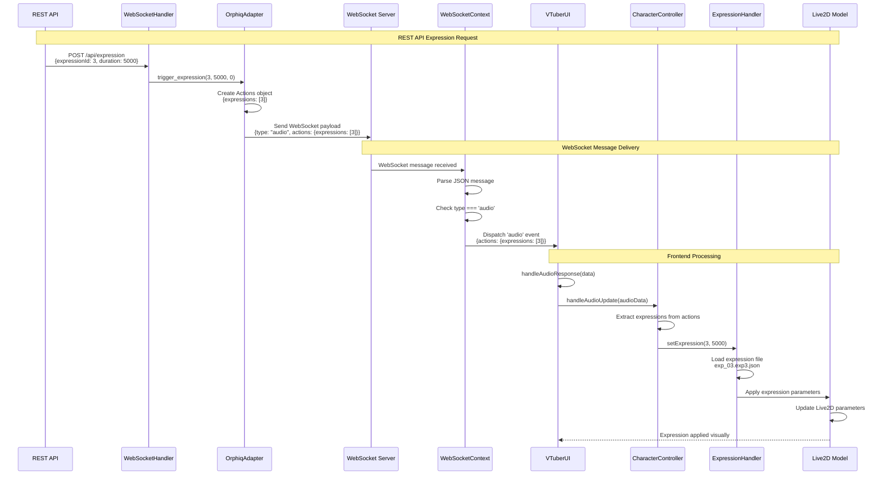
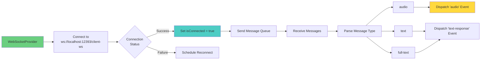
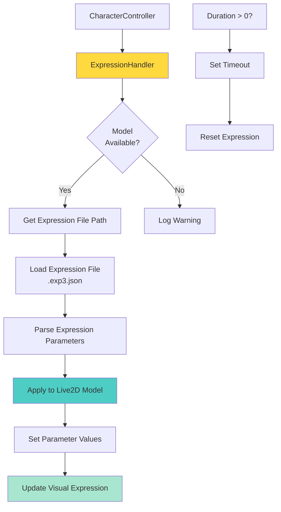
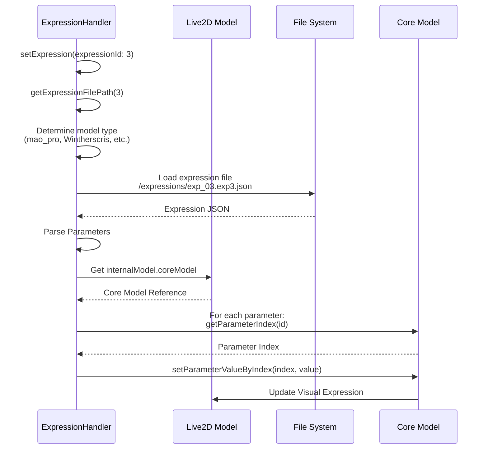
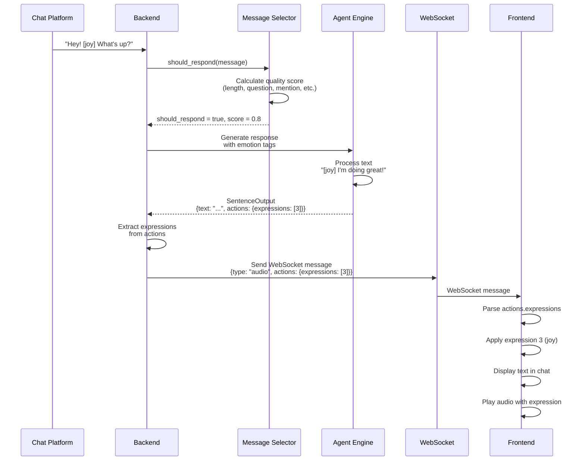
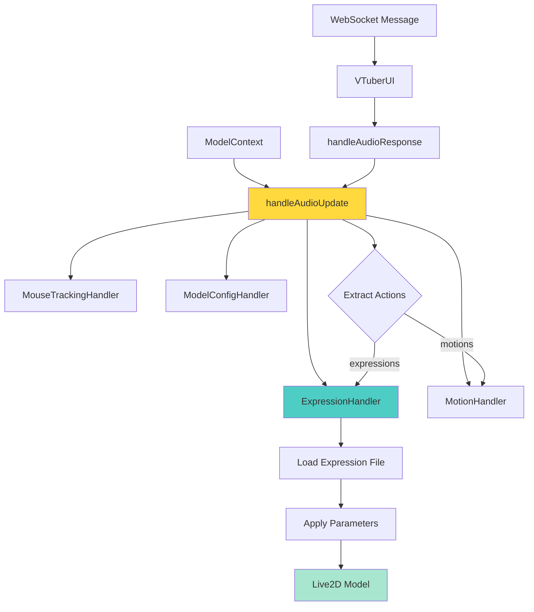
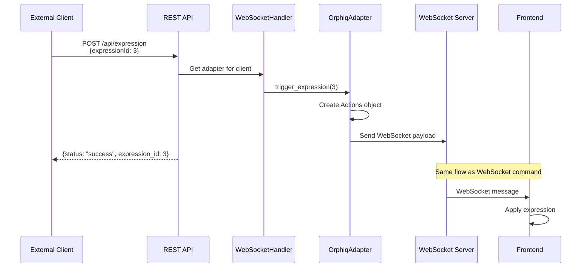
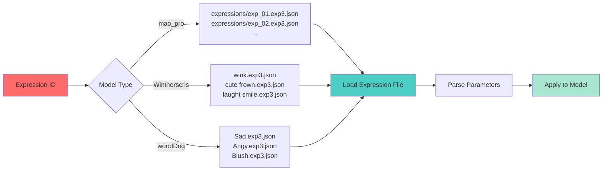
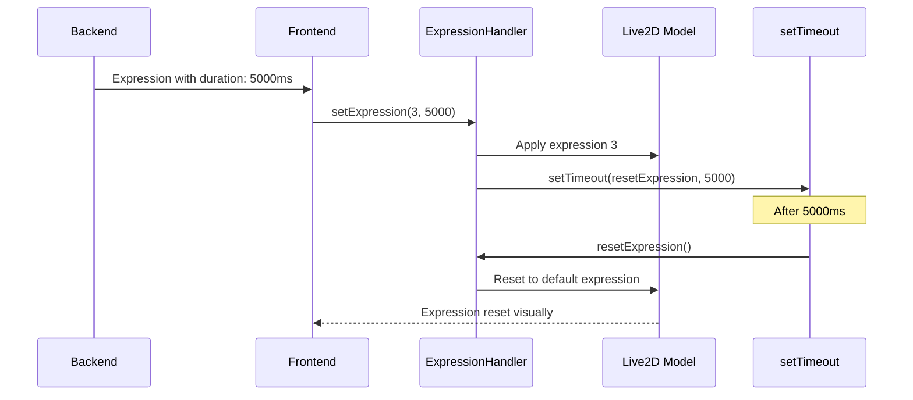
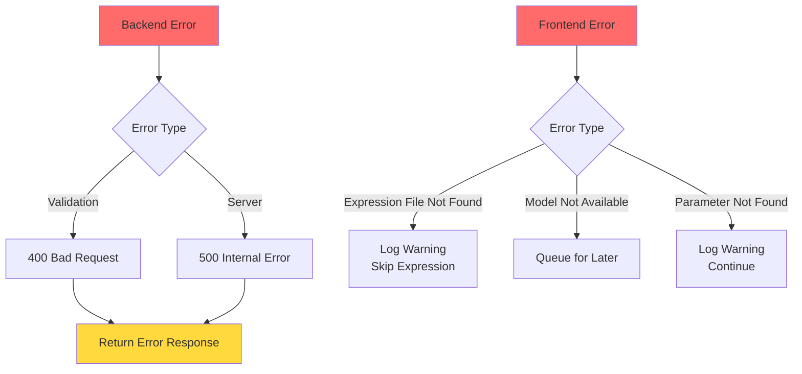

# Backend-Frontend Expression Integration

## Overview

This document explains how backend expressions, chat, and autonomous livestream mode interact with the frontend through WebSocket communication and the character system.

## System Architecture

```mermaid
graph TB
    subgraph "Backend"
        A[REST API<br/>POST /api/expression] --> B[WebSocketHandler]
        C[WebSocket<br/>expression-command] --> B
        D[Autonomous Mode<br/>Chat Message] --> E[Message Selector]
        E --> F[Response Selector]
        F --> G[Agent Engine]
        G --> H[Actions Object]
        H --> B
        I[OrphiqAdapter] --> B
    end
    
    subgraph "WebSocket Communication"
        B --> J[WebSocket Server<br/>ws://localhost:12393/client-ws]
        J --> K[WebSocket Message<br/>type: 'audio'<br/>actions: {expressions: [...]}]
    end
    
    subgraph "Frontend"
        K --> L[WebSocketContext<br/>onmessage handler]
        L --> M[Custom Event<br/>'audio']
        M --> N[VTuberUI<br/>handleAudioResponse]
        N --> O[CharacterController<br/>handleAudioUpdate]
        O --> P[ExpressionHandler<br/>setExpression]
        P --> Q[Live2D Model<br/>Apply Expression]
    end
    
    style A fill:#4ecdc4
    style D fill:#ff6b6b
    style J fill:#95e1d3
    style L fill:#6bcf7f
    style Q fill:#ffd93d
```

## Expression Flow: Backend to Frontend

### Complete Expression Flow



## WebSocket Communication

### WebSocket Message Structure

**Backend sends**:
```json
{
  "type": "audio",
  "audio": null,  // or base64 audio data
  "volumes": [],
  "slice_length": 20,
  "display_text": {
    "text": "Expression 3",
    "name": "CharacterName",
    "avatar": "/avatars/character.png"
  },
  "actions": {
    "expressions": [3]
  },
  "forwarded": false
}
```

**Frontend receives**:
```typescript
// In WebSocketContext.tsx
newSocket.onmessage = (event) => {
  const data = JSON.parse(event.data);
  
  if (data.type === 'audio') {
    const audioData = {
      data: data.audio,
      format: data.format || 'mp3',
      volumes: data.volumes,
      slice_length: data.slice_length,
      display_text: data.display_text,
      actions: data.actions  // Contains expressions
    };
    
    // Dispatch custom event
    window.dispatchEvent(new CustomEvent('audio', { 
      detail: audioData
    }));
  }
};
```

### WebSocket Connection Flow



## Expression Processing in Frontend

### ExpressionHandler Architecture



### Expression File Loading



## Chat Integration

### Chat Message Flow

```mermaid
graph TB
    subgraph "User Input"
        A[User Types Message] --> B[ChatInput Component]
        B --> C[VTuberUI<br/>handleSendMessage]
    end
    
    subgraph "WebSocket Send"
        C --> D[WebSocketContext<br/>sendMessage]
        D --> E[WebSocket.send<br/>{type: 'text-input', text: '...'}]
    end
    
    subgraph "Backend Processing"
        E --> F[WebSocketHandler<br/>_handle_conversation_trigger]
        F --> G[Agent Engine<br/>chat]
        G --> H[Generate Response]
        H --> I[Extract Expressions<br/>from text tags]
        I --> J[Create Actions Object]
    end
    
    subgraph "Response Delivery"
        J --> K[Send WebSocket Message<br/>with actions]
        K --> L[Frontend Receives]
        L --> M[Apply Expressions]
        M --> N[Display in Chat]
    end
    
    style A fill:#ff6b6b
    style G fill:#4ecdc4
    style J fill:#ffd93d
    style M fill:#a8e6cf
```

### Chat with Expression Tags

**Backend generates text with emotion tags**:
```
"I'm so [joy] happy to see you! [smirk]"
```

**Backend extracts expressions**:
```python
# In Live2dModel.extract_emotion()
expressions = model.extract_emotion(text)  # Returns [3, 3]
actions = Actions(expressions=[3, 3])
```

**Frontend receives and applies**:
```typescript
// In CharacterController.handleAudioUpdate()
if (audioData.actions?.expressions) {
  for (const exprId of audioData.actions.expressions) {
    await this.expressionHandler.setExpression(exprId, duration);
  }
}
```

## Autonomous Livestream Mode

### Autonomous Mode Flow

```mermaid
graph TB
    subgraph "Chat Platform"
        A[Twitch/pump.fun<br/>Chat Message] --> B[ChatPlatform<br/>on_message callback]
    end
    
    subgraph "Backend Processing"
        B --> C[_process_chat_message_for_autonomous]
        C --> D[Message Selector<br/>Quality Score Check]
        D -->|Score >= 0.3| E[Response Selector<br/>Generate 3 Options]
        D -->|Score < 0.3| F[Skip Message]
        E --> G[Select Best Response]
        G --> H[Agent Engine<br/>Generate with Context]
        H --> I[Extract Expressions<br/>from Response]
        I --> J[Create Actions Object]
    end
    
    subgraph "WebSocket Delivery"
        J --> K[Send to WebSocket Clients]
        K --> L[Frontend Receives]
        L --> M[Apply Expressions]
        M --> N[Play Audio]
        N --> O[Display in Chat]
    end
    
    style A fill:#9146ff
    style D fill:#ffd93d
    style H fill:#4ecdc4
    end
```

### Autonomous Mode with Expressions



## Character System Integration

### Character Controller Architecture



### Expression Application Process

```typescript
// In CharacterController.handleAudioUpdate()
async handleAudioUpdate(audioData: AudioData): Promise<void> {
  // Extract expressions from actions
  if (audioData.actions?.expressions) {
    const expressions = audioData.actions.expressions;
    
    // Apply each expression
    for (const expressionId of expressions) {
      const duration = audioData.duration || 0;
      await this.expressionHandler.setExpression(
        typeof expressionId === 'number' ? expressionId : 0,
        duration
      );
    }
  }
  
  // Process audio for lip sync
  if (audioData.volumes) {
    // Update mouth based on volume
    this.expressionHandler.updateMouth(volume);
  }
}
```

## REST API to Frontend Flow

### REST API Expression Request



## Expression File Structure

### Model-Specific Expression Mapping



## Expression Duration Management

### Timed Expression Flow



## Integration Points Summary

### Key Integration Points

1. **WebSocket Message Format**:
   - Type: `"audio"`
   - Actions: `{expressions: [number[]]}`
   - Display text: `{text: string, name: string}`

2. **Frontend Event System**:
   - `'audio'` event: Dispatched from WebSocketContext
   - `'text-response'` event: Dispatched for text messages
   - Handled in VTuberUI component

3. **Character Controller**:
   - Receives audio data with actions
   - Extracts expressions from actions
   - Delegates to ExpressionHandler

4. **ExpressionHandler**:
   - Loads expression files (.exp3.json)
   - Applies parameters to Live2D model
   - Manages expression duration and reset

5. **Live2D Model**:
   - Receives parameter updates
   - Renders expression visually
   - Supports smooth transitions

## Error Handling

### Error Flow



## Performance Considerations

1. **Expression File Caching**: ExpressionHandler caches loaded expression files
2. **Parameter Updates**: Batch parameter updates for efficiency
3. **WebSocket Batching**: Multiple expressions in single message
4. **Duration Management**: Efficient timeout handling for expression reset

## Future Enhancements

1. **Expression Blending**: Smooth transitions between expressions
2. **Priority System**: Expression priority queue (backend planned)
3. **Expression Intensity**: Variable expression strength
4. **Custom Expressions**: User-defined expression triggers
5. **Expression Sequences**: Chain multiple expressions together

