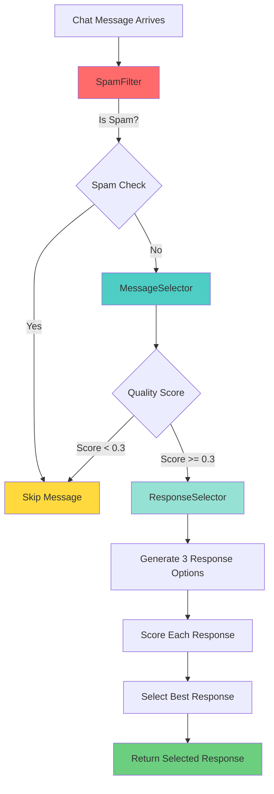
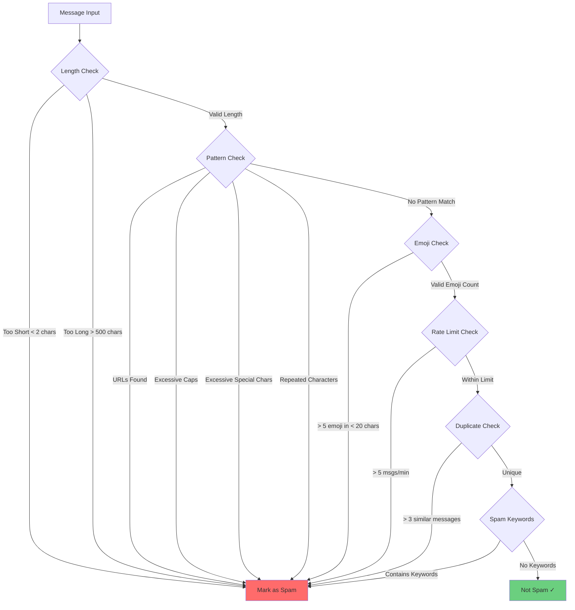
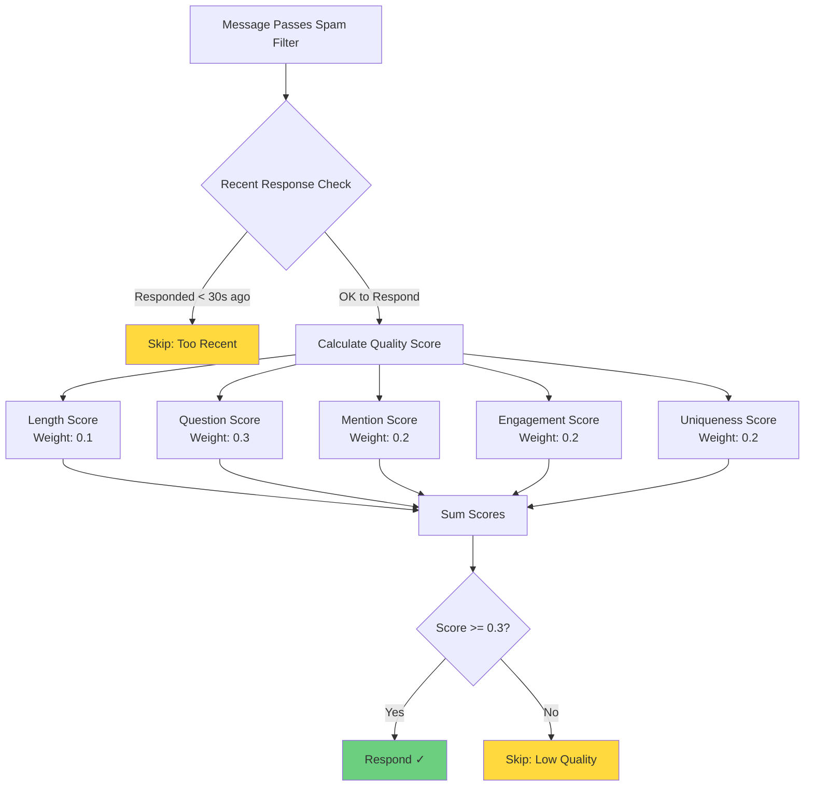
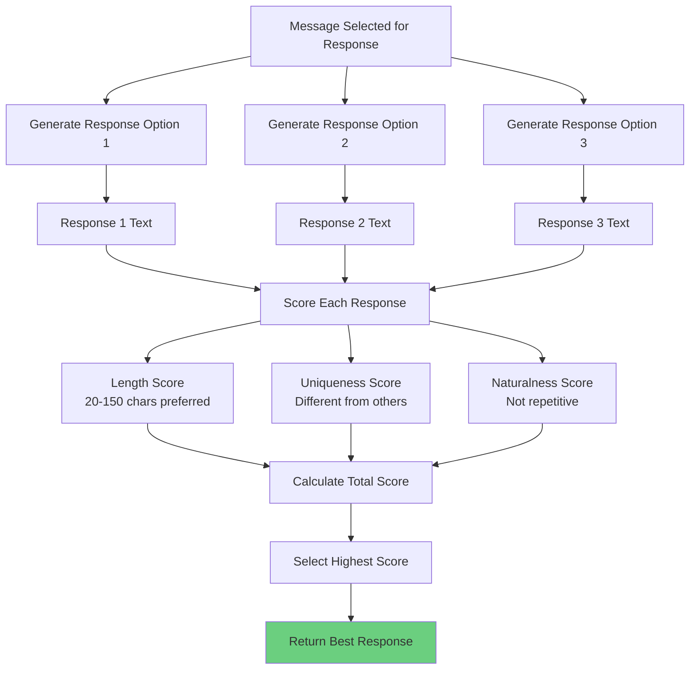
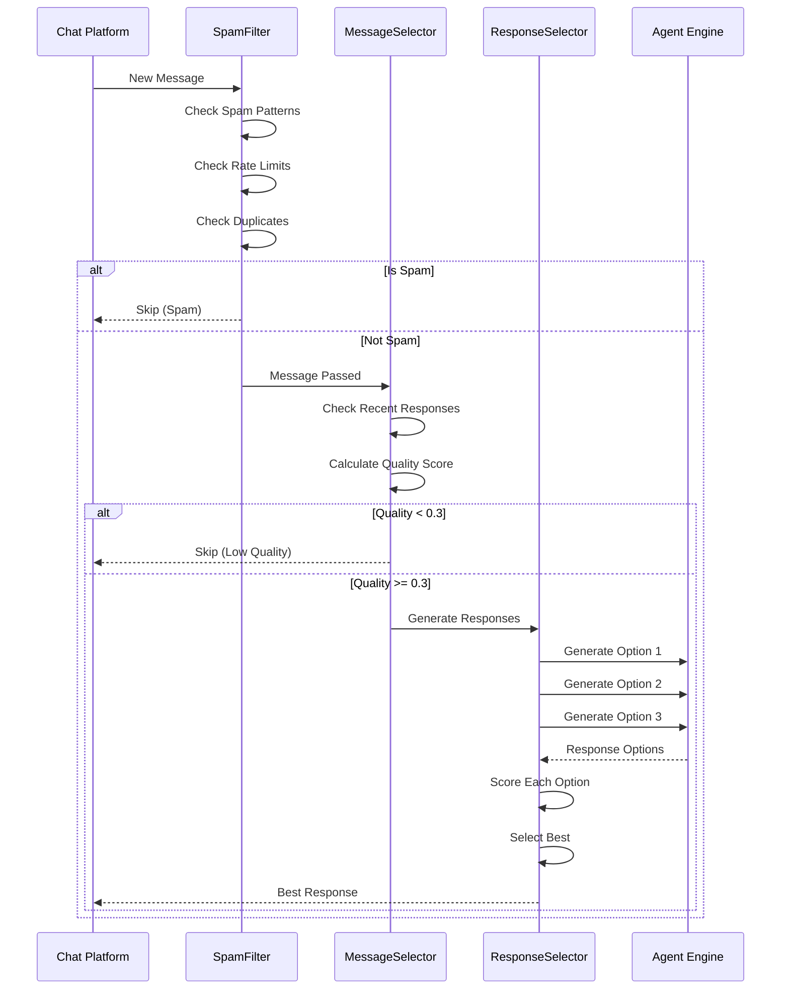

# Chat Message Filtering and Response Selection System

## Overview

This document explains how the autonomous chat system filters spam, scores message quality, and selects the best responses for pump.fun, Twitch, and other livestreaming platforms.

## System Architecture



## Spam Detection System

### Overview

The `SpamFilter` class uses multiple heuristics to detect spam messages before they reach the quality scoring system.

### Spam Detection Flow



### Spam Detection Criteria

#### 1. **Length-Based Detection**
- **Too Short**: Messages with less than 2 characters are considered spam
- **Too Long**: Messages over 500 characters are likely copy-paste spam

#### 2. **Pattern-Based Detection**
The system checks for these regex patterns:
- **URLs**: `https?://[^\s]+` - Detects HTTP/HTTPS links
- **Excessive Caps**: `[A-Z]{5,}` - 5 or more consecutive uppercase letters
- **Excessive Special Chars**: `[!@#$%^&*()]{3,}` - 3 or more consecutive special characters
- **Repeated Characters**: `(.)\1{4,}` - Same character repeated 5+ times (e.g., "aaaaa")

#### 3. **Emoji Detection**
- Messages with more than 5 emoji in less than 20 characters are flagged as spam
- Uses Unicode range `\U0001F300-\U0001F9FF` to detect emoji

#### 4. **Rate Limiting**
- Tracks messages per user using a sliding window
- **Limit**: Maximum 5 messages per minute per user
- Uses a deque to store the last 10 message timestamps per user
- Automatically expires messages older than 60 seconds

#### 5. **Duplicate Detection**
- Maintains a rolling window of the last 50 messages
- Normalizes messages (removes extra whitespace) for comparison
- Flags messages if 3 or more identical messages appear in the recent history

#### 6. **Spam Keywords**
The system checks for common spam phrases:
- "buy now", "click here", "free money", "guaranteed profit"
- "pump it", "to the moon", "scam", "hack", "cheat"

### Spam Detection Return Values

When a message is detected as spam, the system returns:
- `(True, "reason")` - Tuple indicating spam status and reason code
- Reason codes include:
  - `"message_too_short"`
  - `"message_too_long"`
  - `"contains_url"`
  - `"excessive_emoji"`
  - `"rate_limit_exceeded"`
  - `"duplicate_message"`
  - `"contains_spam_keyword_{keyword}"`
  - `"matches_spam_pattern_{pattern}"`

## Message Quality Scoring System

### Overview

The `MessageSelector` class scores messages on multiple dimensions to determine if they're worth responding to. Only messages that pass spam filtering and meet the quality threshold (≥ 0.3) will receive responses.

### Quality Scoring Flow



### Quality Score Components

The quality score is calculated as a weighted sum of five components:

#### 1. **Length Score** (Weight: 0.1)
Evaluates message length appropriateness:

| Length Range | Score Multiplier | Example |
|-------------|-----------------|---------|
| 10-200 chars | 1.0 (full points) | "What do you think about this?" |
| 5-10 or 200-300 chars | 0.5 (half points) | "Hi" or very long message |
| < 5 or > 300 chars | 0.1 (minimal points) | "a" or extremely long |

**Formula**: `length_score = weight * multiplier`

#### 2. **Question Score** (Weight: 0.3)
Detects questions that invite responses:
- **Contains "?"**: Full points (1.0)
- **No "?"**: 0 points

**Formula**: `question_score = weight * (1.0 if '?' in message else 0.0)`

#### 3. **Mention Score** (Weight: 0.2)
Detects if the character name is mentioned:
- **Character name found**: Full points (1.0)
- **No mention**: 0 points

**Formula**: `mention_score = weight * (1.0 if character_name in message else 0.0)`

#### 4. **Engagement Score** (Weight: 0.2)
Measures engagement through exclamation marks:
- **1-3 exclamation marks**: 0.8 multiplier (good engagement)
- **0 exclamation marks**: 0.5 multiplier (neutral)
- **> 3 exclamation marks**: 0 points (excessive, likely spam)

**Formula**: `engagement_score = weight * multiplier`

#### 5. **Uniqueness Score** (Weight: 0.2)
Currently uses a simplified approach:
- Assumes most messages are somewhat unique: 0.7 multiplier
- Future: Could implement similarity checking against recent messages

**Formula**: `uniqueness_score = weight * 0.7`

### Quality Score Calculation Example

**Example Message**: "Hey! What do you think about pump.fun? @CharacterName"

1. **Length Score**: 50 chars (within 10-200) → `0.1 * 1.0 = 0.1`
2. **Question Score**: Contains "?" → `0.3 * 1.0 = 0.3`
3. **Mention Score**: Contains character name → `0.2 * 1.0 = 0.2`
4. **Engagement Score**: 1 exclamation mark → `0.2 * 0.8 = 0.16`
5. **Uniqueness Score**: Default → `0.2 * 0.7 = 0.14`

**Total Score**: `0.1 + 0.3 + 0.2 + 0.16 + 0.14 = 0.9` ✓ (Above 0.3 threshold)

### Response Cooldown

To prevent over-responding to the same user:
- **Minimum Interval**: 30 seconds between responses to the same user
- **Tracking**: Maintains a dictionary of `{username: last_response_time}`
- **Cleanup**: Automatically removes entries older than 5 minutes

## Response Selection System

### Overview

The `ResponseSelector` class generates multiple response options and selects the best one based on quality criteria.

### Response Selection Flow



### Response Generation

1. **Multiple Options**: Generates 3 response options by default
2. **Prompt Variations**: Adds slight variations to the prompt:
   - Original message
   - "Original message (respond briefly)"
   - "Original message (respond naturally)"
3. **Agent Engine**: Uses the same agent engine as regular conversations

### Response Scoring Criteria

Each generated response is scored on three dimensions:

#### 1. **Length Score** (Weight: 0.4)
- **20-150 characters**: Full points (0.4) - Ideal for chat
- **10-20 or 150-200 characters**: Half points (0.2)
- **< 10 or > 200 characters**: Minimal points (0.1)

#### 2. **Uniqueness Score** (Weight: 0.3)
- Calculates similarity to other response options
- Uses Jaccard similarity (word overlap)
- **Formula**: `uniqueness_score = 0.3 * (1.0 - average_similarity)`
- Higher score = more unique response

#### 3. **Naturalness Score** (Weight: 0.3)
- Checks for repetitive text (same word repeated 3+ times in < 20 words)
- **Not repetitive**: Full points (0.3)
- **Repetitive**: 0 points

### Response Selection Example

**Generated Options**:
1. "That's really interesting! I think pump.fun has potential." (58 chars)
2. "Interesting! Pump.fun interesting interesting interesting." (52 chars, repetitive)
3. "I'm not sure about that." (25 chars)

**Scoring**:
1. **Option 1**: Length(0.4) + Uniqueness(0.25) + Naturalness(0.3) = **0.95**
2. **Option 2**: Length(0.4) + Uniqueness(0.2) + Naturalness(0.0) = **0.6**
3. **Option 3**: Length(0.4) + Uniqueness(0.3) + Naturalness(0.3) = **1.0**

**Selected**: Option 3 (highest score)

## Complete Processing Pipeline



## Configuration Parameters

### SpamFilter Configuration

```python
max_messages_per_minute = 5      # Rate limit per user
max_similar_messages = 3         # Duplicate threshold
recent_messages_window = 50      # Messages to track for duplicates
```

### MessageSelector Configuration

```python
min_quality_score = 0.3          # Minimum score to respond
min_response_interval = 30        # Seconds between responses to same user

weights = {
    'length': 0.1,               # Length importance
    'question': 0.3,              # Question importance (highest)
    'mention': 0.2,               # Mention importance
    'engagement': 0.2,           # Engagement importance
    'uniqueness': 0.2,            # Uniqueness importance
}
```

### ResponseSelector Configuration

```python
num_options = 3                  # Number of responses to generate
preferred_length_range = (20, 150)  # Preferred response length
```

## Performance Considerations

1. **Caching**: Filter and selector instances are cached globally to avoid recreation
2. **Memory Management**: Uses bounded deques to limit memory usage
3. **Automatic Cleanup**: Old tracking data is automatically cleaned up
4. **Early Exit**: Spam detection happens first to avoid unnecessary processing

## Future Enhancements

1. **Machine Learning**: Could use ML models for spam detection
2. **Sentiment Analysis**: Add sentiment scoring to quality metrics
3. **Context Awareness**: Better uniqueness checking using semantic similarity
4. **User Reputation**: Track user reputation to adjust thresholds
5. **Platform-Specific Rules**: Different rules for different platforms (pump.fun vs Twitch)

## Usage Example

```python
from chat_platforms.message_filters import SpamFilter, MessageSelector, ResponseSelector

# Initialize
spam_filter = SpamFilter()
message_selector = MessageSelector()
response_selector = ResponseSelector()

# Check spam
is_spam, reason = spam_filter.is_spam(chat_message)
if is_spam:
    return  # Skip spam

# Check quality
should_respond, score, reason = message_selector.should_respond(
    chat_message, 
    character_name="CharacterName"
)
if not should_respond:
    return  # Skip low quality

# Generate and select best response
best_response = await response_selector.select_best_response(
    context_cache,
    chat_message,
    context,
    num_options=3
)
```

