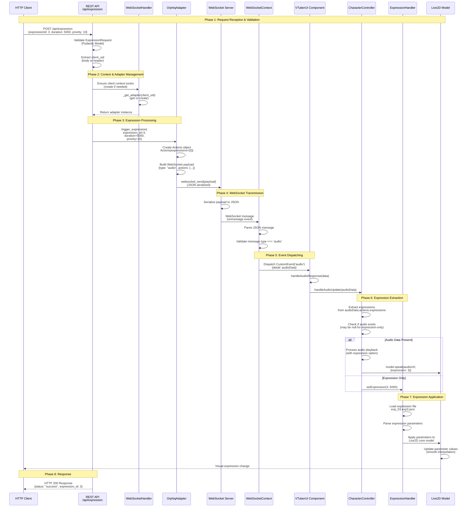
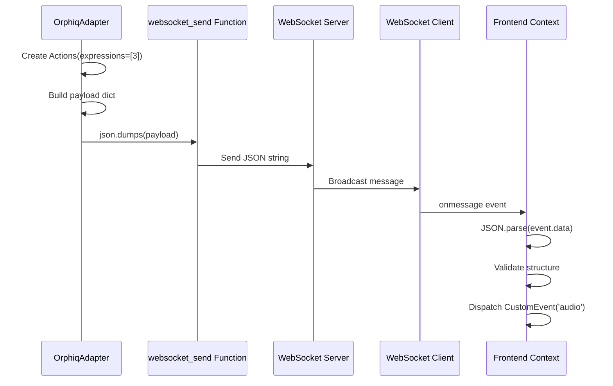
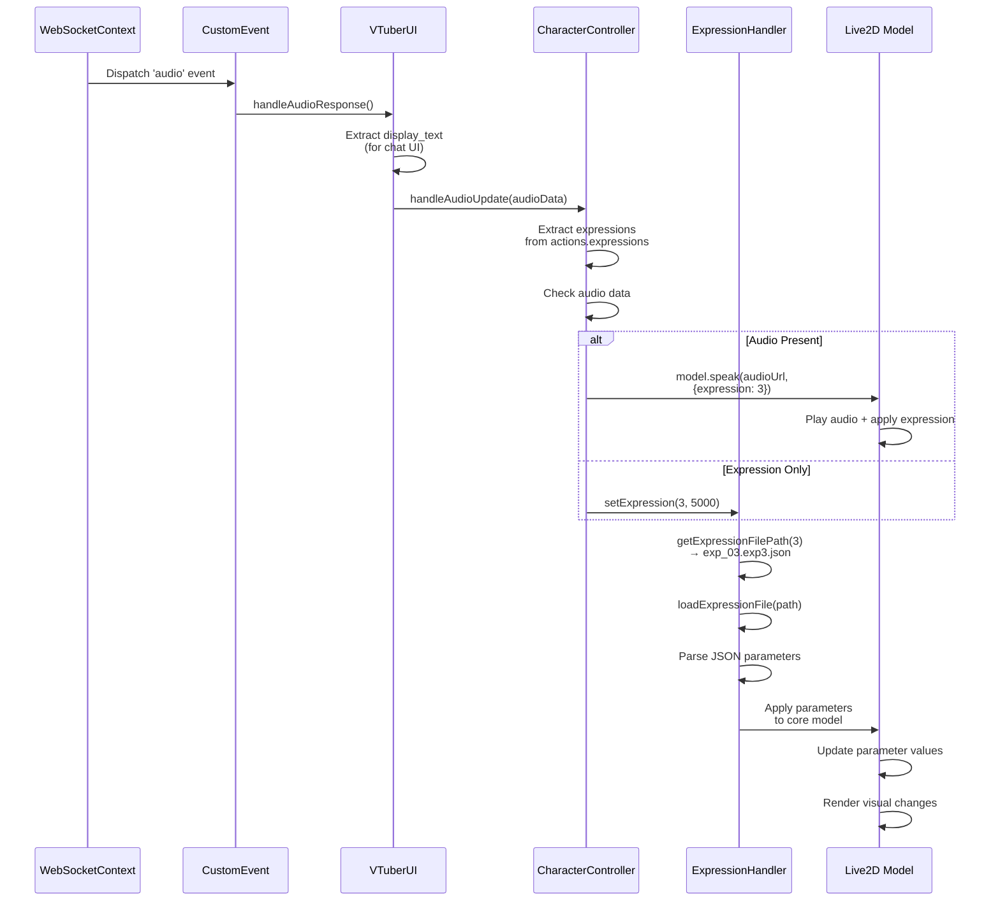
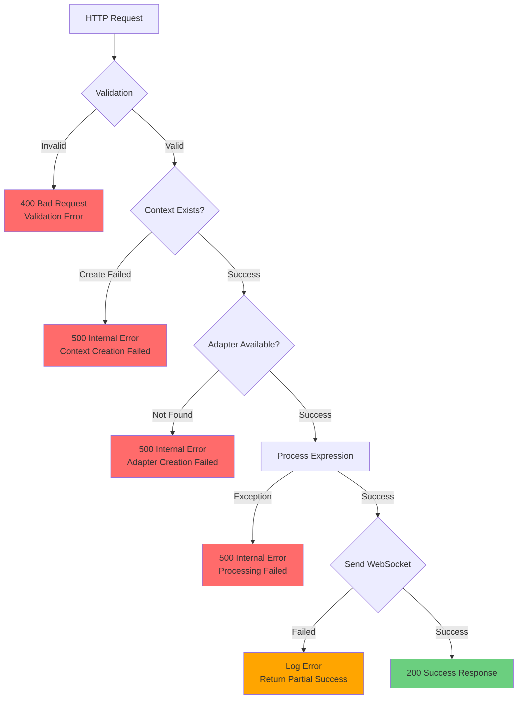

# Expression API Lifecycle Documentation

## Overview

This document provides an in-depth explanation of how facial expressions are sent as JSON objects through backend API routes, processed, and applied to the Live2D character model in the frontend. It covers the complete lifecycle from HTTP request to visual expression application, and demonstrates how the system maintains Single Responsibility Principle (SRP) throughout.

## Table of Contents

1. [System Architecture](#system-architecture)
2. [Complete Lifecycle Flow](#complete-lifecycle-flow)
3. [Component Responsibilities (SRP)](#component-responsibilities-srp)
4. [Data Structures](#data-structures)
5. [Request Flow](#request-flow)
6. [WebSocket Communication](#websocket-communication)
7. [Frontend Processing](#frontend-processing)
8. [Error Handling](#error-handling)
9. [Example Usage](#example-usage)

---

## System Architecture

The expression system follows a layered architecture with clear separation of concerns:

```mermaid
graph TB
    subgraph "Client Layer"
        A[HTTP Client<br/>POST /api/expression]
    end
    
    subgraph "API Layer"
        B[REST API Route<br/>routes.py]
        C[Request Validation<br/>ExpressionRequest Model]
    end
    
    subgraph "Handler Layer"
        D[WebSocketHandler<br/>Client Management]
        E[Adapter Selection<br/>_get_adapter]
    end
    
    subgraph "Adapter Layer"
        F[OrphiqAdapter<br/>Expression Processing]
        G[Actions Creation<br/>output_types.Actions]
    end
    
    subgraph "Communication Layer"
        H[WebSocket Server<br/>Message Broadcasting]
        I[JSON Serialization<br/>Payload Creation]
    end
    
    subgraph "Frontend Layer"
        J[WebSocketContext<br/>Message Reception]
        K[VTuberUI<br/>Event Dispatch]
        L[CharacterController<br/>Audio Processing]
        M[ExpressionHandler<br/>Expression Application]
        N[Live2D Model<br/>Visual Rendering]
    end
    
    A -->|JSON Request| B
    B -->|Validate| C
    C -->|Route| D
    D -->|Get/Create| E
    E -->|Delegate| F
    F -->|Create| G
    G -->|Send| H
    H -->|Broadcast| I
    I -->|WebSocket| J
    J -->|Custom Event| K
    K -->|Audio Data| L
    L -->|Extract Actions| M
    M -->|Apply| N
    
    style A fill:#4ecdc4
    style B fill:#95e1d3
    style D fill:#ffd93d
    style F fill:#ff6b6b
    style H fill:#6bcf7f
    style N fill:#a8e6cf
```



---

## Complete Lifecycle Flow

### End-to-End Expression Request Flow



---

## Component Responsibilities (SRP)

The system maintains Single Responsibility Principle through clear component boundaries:

### 1. REST API Route (`routes.py`)

**Responsibility**: HTTP request handling and validation

```python
@router.post("/api/expression")
async def set_expression_endpoint(
    request: ExpressionRequest,
    x_client_uid: Optional[str] = Header(None, alias="X-Client-UID")
):
```

**SRP Compliance**:
- ✅ **Single Purpose**: Handles HTTP request/response cycle only
- ✅ **Delegation**: Delegates business logic to WebSocketHandler
- ✅ **Validation**: Uses Pydantic models for input validation
- ✅ **No Business Logic**: Does not contain expression processing logic

**Key Responsibilities**:
- Extract and validate request parameters
- Determine client_uid (from body or header)
- Ensure client context exists
- Delegate to adapter via WebSocketHandler
- Return HTTP response

---

### 2. WebSocketHandler (`websocket_handler.py`)

**Responsibility**: Client connection and adapter management

```python
class WebSocketHandler:
    def __init__(self, default_context_cache: ServiceContext):
        self.client_connections: Dict[str, WebSocket] = {}
        self.client_contexts: Dict[str, ServiceContext] = {}
        self.client_adapters: Dict[str, BackendAdapter] = {}
```

**SRP Compliance**:
- ✅ **Single Purpose**: Manages client state and adapter lifecycle
- ✅ **No Expression Logic**: Does not know how expressions work
- ✅ **Adapter Factory**: Creates and caches adapters per client
- ✅ **Connection Management**: Handles WebSocket connections only

**Key Responsibilities**:
- Maintain client-to-adapter mappings
- Create ServiceContext instances per client
- Provide adapter instances via `_get_adapter()`
- Manage WebSocket connections
- Route messages to appropriate handlers

---

### 3. OrphiqAdapter (`adapters/orphiq_adapter.py`)

**Responsibility**: Expression processing and WebSocket payload creation

```python
class OrphiqAdapter(BackendAdapter):
    async def trigger_expression(
        self,
        expression_id: int,
        duration: Optional[int] = None,
        priority: int = 0,
    ) -> Dict[str, Any]:
```

**SRP Compliance**:
- ✅ **Single Purpose**: Transforms expression requests into WebSocket payloads
- ✅ **No HTTP Logic**: Does not know about HTTP requests
- ✅ **No Frontend Logic**: Does not know about Live2D model details
- ✅ **Protocol Agnostic**: Works with any WebSocket send function

**Key Responsibilities**:
- Create `Actions` object from expression parameters
- Build WebSocket payload structure
- Serialize payload to JSON
- Send via WebSocket connection
- Track current expression state
- Return processing result

---

### 4. Actions (`agent/output_types.py`)

**Responsibility**: Data structure for expression/motion actions

```python
@dataclass
class Actions:
    expressions: Optional[List[str] | List[int]] = None
    pictures: Optional[List[str]] = None
    sounds: Optional[List[str]] = None
    
    def to_dict(self) -> dict:
        return {k: v for k, v in asdict(self).items() if v is not None}
```

**SRP Compliance**:
- ✅ **Single Purpose**: Represents action data structure
- ✅ **No Processing Logic**: Pure data container
- ✅ **Serialization**: Handles JSON conversion only
- ✅ **Immutable Design**: Data class with optional fields

**Key Responsibilities**:
- Store expression IDs as list
- Provide JSON serialization
- Support optional action types
- Maintain type safety

---

### 5. WebSocketContext (`frontend/WebSocketContext.tsx`)

**Responsibility**: WebSocket connection and message reception

```typescript
newSocket.onmessage = (event) => {
    const data = JSON.parse(event.data);
    if (data.type === 'audio') {
        window.dispatchEvent(new CustomEvent('audio', { detail: audioData }));
    }
}
```

**SRP Compliance**:
- ✅ **Single Purpose**: WebSocket communication only
- ✅ **No Expression Logic**: Does not process expressions
- ✅ **Event Dispatcher**: Converts WebSocket messages to DOM events
- ✅ **No UI Logic**: Does not render or manipulate UI

**Key Responsibilities**:
- Maintain WebSocket connection
- Parse incoming JSON messages
- Validate message structure
- Dispatch custom events
- Handle connection lifecycle
- Queue messages if needed

---

### 6. VTuberUI (`frontend/VTuberUI.tsx`)

**Responsibility**: Event coordination and UI state management

```typescript
const handleAudioResponse = async (data: AudioData) => {
    if (data.display_text) {
        setMessages(prev => [...prev, { text: data.display_text.text, role: 'ai' }]);
    }
    if (characterHandler) {
        await characterHandler.handleAudioUpdate(audioData);
    }
}
```

**SRP Compliance**:
- ✅ **Single Purpose**: Coordinates between WebSocket events and character controller
- ✅ **No Expression Logic**: Does not apply expressions directly
- ✅ **UI State**: Manages chat messages and UI state
- ✅ **Delegation**: Delegates character control to CharacterController

**Key Responsibilities**:
- Listen for 'audio' custom events
- Extract display text for chat UI
- Coordinate with CharacterController
- Manage UI state updates
- Handle error display

---

### 7. CharacterController (`frontend/CharacterController.ts`)

**Responsibility**: Audio processing and expression extraction

```typescript
async handleAudioUpdate(audioData: AudioData): Promise<void> {
    const expression = audioData.actions?.expressions?.[0];
    if (expression !== undefined) {
        // Apply expression via model or ExpressionHandler
    }
}
```

**SRP Compliance**:
- ✅ **Single Purpose**: Processes audio data and extracts actions
- ✅ **No WebSocket Logic**: Does not handle WebSocket connections
- ✅ **No Expression Application**: Delegates to ExpressionHandler
- ✅ **Audio Focus**: Handles audio playback and lip sync

**Key Responsibilities**:
- Extract expressions from actions
- Process audio data (if present)
- Queue audio for playback
- Coordinate with ExpressionHandler
- Manage audio playback state
- Handle lip sync with volumes

---

### 8. ExpressionHandler (`frontend/ExpressionHandler.ts`)

**Responsibility**: Expression file loading and Live2D parameter application

```typescript
async setExpression(expressionId: number, duration: number = 3000): Promise<void> {
    const expressionFile = this.getExpressionFilePath(expressionId);
    const expression = await this.loadExpressionFile(expressionFile);
    // Apply parameters to Live2D model
}
```

**SRP Compliance**:
- ✅ **Single Purpose**: Applies expressions to Live2D model
- ✅ **No Audio Logic**: Does not handle audio playback
- ✅ **No WebSocket Logic**: Does not handle communication
- ✅ **File Management**: Handles expression file loading

**Key Responsibilities**:
- Map expression IDs to file paths
- Load expression JSON files
- Parse expression parameters
- Apply parameters to Live2D core model
- Handle expression duration/timeouts
- Manage expression state

---

### 9. Live2D Model (`frontend/Live2D SDK`)

**Responsibility**: Visual rendering and parameter updates

**SRP Compliance**:
- ✅ **Single Purpose**: Renders character visuals
- ✅ **No Business Logic**: Does not know about expressions conceptually
- ✅ **Parameter Updates**: Updates parameter values only
- ✅ **Rendering**: Handles visual interpolation and rendering

**Key Responsibilities**:
- Update parameter values
- Interpolate parameter changes smoothly
- Render character visuals
- Handle model lifecycle
- Manage rendering loop

---

## Data Structures

### Request Structure

#### HTTP Request (REST API)

```json
POST /api/expression
Content-Type: application/json
X-Client-UID: optional-client-id

{
  "expressionId": 3,
  "duration": 5000,
  "priority": 10,
  "client_uid": "optional-client-id"
}
```

#### Pydantic Request Model

```python
class ExpressionRequest(BaseModel):
    expressionId: int                    # Required: Expression ID (0-7 typically)
    duration: Optional[int] = 0          # Optional: Duration in milliseconds (0 = permanent)
    priority: Optional[int] = 0          # Optional: Priority level (higher = more important)
    client_uid: Optional[str] = None     # Optional: Client UID (can also use X-Client-UID header)
```

---

### WebSocket Payload Structure

#### Payload Created by Adapter

```json
{
  "type": "audio",
  "audio": null,
  "volumes": [],
  "slice_length": 20,
  "display_text": {
    "text": "Expression 3",
    "name": "CharacterName",
    "avatar": "/avatars/character.png"
  },
  "actions": {
    "expressions": [3]
  },
  "forwarded": false
}
```

#### Actions Object Structure

```python
@dataclass
class Actions:
    expressions: Optional[List[int]] = None    # Expression IDs: [3] or [1, 3]
    pictures: Optional[List[str]] = None       # Picture URLs (not used for expressions)
    sounds: Optional[List[str]] = None         # Sound URLs (not used for expressions)
```

---

### Response Structure

#### HTTP Response

```json
{
  "status": "success",
  "expression_id": 3,
  "result": {
    "status": "success",
    "expression_id": 3,
    "duration": 5000,
    "priority": 10
  }
}
```

#### Error Response

```json
{
  "detail": "Error setting expression: <error message>"
}
```

---

## Request Flow

### Detailed Step-by-Step Flow

```mermaid
flowchart TD
    Start([HTTP Client sends POST request]) --> Validate[Validate ExpressionRequest]
    Validate -->|Invalid| Error1[Return 400 Bad Request]
    Validate -->|Valid| ExtractUID[Extract client_uid<br/>from body or header]
    
    ExtractUID --> CheckContext{Client context<br/>exists?}
    CheckContext -->|No| CreateContext[Create ServiceContext<br/>for client]
    CheckContext -->|Yes| GetAdapter
    CreateContext --> GetAdapter[Get or create adapter<br/>via _get_adapter]
    
    GetAdapter --> TriggerExpr[Call adapter.trigger_expression]
    TriggerExpr --> CreateActions[Create Actions object<br/>Actions(expressions=[id])]
    
    CreateActions --> BuildPayload[Build WebSocket payload<br/>with type: 'audio']
    BuildPayload --> Serialize[Serialize to JSON string]
    Serialize --> SendWS[Send via websocket_send]
    
    SendWS --> Broadcast[WebSocket server broadcasts<br/>to connected clients]
    Broadcast --> ReceiveWS[Frontend WebSocketContext<br/>receives message]
    
    ReceiveWS --> ParseJSON[Parse JSON message]
    ParseJSON --> ValidateType{type === 'audio'?}
    ValidateType -->|No| Skip[Skip message]
    ValidateType -->|Yes| DispatchEvent[Dispatch CustomEvent('audio')]
    
    DispatchEvent --> VTuberUI[VTuberUI handles event]
    VTuberUI --> ExtractActions[Extract actions.expressions]
    ExtractActions --> HasAudio{Audio data<br/>present?}
    
    HasAudio -->|Yes| PlayAudio[Play audio with expression<br/>via model.speak]
    HasAudio -->|No| ApplyExpr[Apply expression directly<br/>via ExpressionHandler]
    
    PlayAudio --> ApplyExpr
    ApplyExpr --> LoadFile[Load expression file<br/>exp_03.exp3.json]
    LoadFile --> ApplyParams[Apply parameters to<br/>Live2D core model]
    ApplyParams --> VisualUpdate[Character expression<br/>changes visually]
    
    VisualUpdate --> End([Expression Applied])
    
    style Start fill:#4ecdc4
    style Validate fill:#95e1d3
    style TriggerExpr fill:#ffd93d
    style Broadcast fill:#6bcf7f
    style VisualUpdate fill:#a8e6cf
    style Error1 fill:#ff6b6b
```

---

## WebSocket Communication

### Message Flow Diagram



### WebSocket Message Types

The system uses a unified `"audio"` message type for expressions, even when no audio data is present. This allows expressions to be sent:

1. **With Audio**: Expression + audio playback
2. **Without Audio**: Expression-only (audio: null)

```typescript
// Expression-only message
{
  type: "audio",
  audio: null,              // No audio data
  actions: {
    expressions: [3]        // Expression ID
  }
}

// Expression with audio
{
  type: "audio",
  audio: "base64_encoded...", // Audio data
  actions: {
    expressions: [3]        // Expression ID
  }
}
```

---

## Frontend Processing

### Expression Application Flow



### Expression File Structure

Expression files are JSON files containing parameter definitions:

```json
{
  "Type": "Live2D Expression",
  "Parameters": [
    {
      "Id": "ParamAngleX",
      "Value": 0.5
    },
    {
      "Id": "ParamAngleY",
      "Value": -0.3
    },
    {
      "Id": "ParamEyeLOpen",
      "Value": 0.8
    },
    {
      "Id": "ParamEyeROpen",
      "Value": 0.8
    },
    {
      "Id": "ParamMouthOpenY",
      "Value": 0.6
    }
  ]
}
```

---

## Error Handling

### Error Flow Diagram



### Error Handling by Component

#### REST API Route

```python
try:
    # Process expression
    result = await adapter.trigger_expression(...)
    return {"status": "success", ...}
except ValueError as e:
    logger.error(f"Validation error: {e}")
    raise HTTPException(status_code=400, detail=str(e))
except Exception as e:
    logger.error(f"Error setting expression: {e}", exc_info=True)
    raise HTTPException(status_code=500, detail=f"Error setting expression: {str(e)}")
```

#### Adapter

```python
try:
    # Create and send payload
    await self.websocket_send(json.dumps(payload))
    return {"status": "success", ...}
except Exception as e:
    logger.error(f"Error triggering expression: {e}")
    return {"status": "error", "error": str(e)}
```

#### Frontend

```typescript
try {
    const expression = audioData.actions?.expressions?.[0];
    if (expression !== undefined) {
        await expressionHandler.setExpression(expression, duration);
    }
} catch (error) {
    console.error('[CharacterController] Error applying expression:', error);
    // Continue processing other actions
}
```

---

## Example Usage

### Example 1: Simple Expression Request

```bash
curl -X POST http://localhost:12393/api/expression \
  -H "Content-Type: application/json" \
  -d '{
    "expressionId": 3,
    "duration": 5000,
    "priority": 10
  }'
```

**Response**:
```json
{
  "status": "success",
  "expression_id": 3,
  "result": {
    "status": "success",
    "expression_id": 3,
    "duration": 5000,
    "priority": 10
  }
}
```

**What Happens**:
1. Request validated by `ExpressionRequest` model
2. Client context ensured (default if not specified)
3. Adapter retrieved/created for client
4. Expression processed and sent via WebSocket
5. Frontend receives message and applies expression
6. Character displays expression for 5 seconds

---

### Example 2: Expression with Client UID

```bash
curl -X POST http://localhost:12393/api/expression \
  -H "Content-Type: application/json" \
  -H "X-Client-UID: user-123" \
  -d '{
    "expressionId": 1,
    "duration": 0
  }'
```

**What Happens**:
1. Client UID extracted from header: `user-123`
2. Context created/retrieved for `user-123`
3. Adapter created/retrieved for `user-123`
4. Expression sent to WebSocket connection for `user-123`
5. Expression applied permanently (duration: 0)

---

### Example 3: Expression-Only (No Audio)

When an expression is requested without audio, the system sends:

```json
{
  "type": "audio",
  "audio": null,
  "actions": {
    "expressions": [3]
  }
}
```

The frontend handles this by:
1. Detecting `audio: null`
2. Skipping audio playback
3. Directly applying expression via `ExpressionHandler`
4. Updating character visuals immediately

---

### Example 4: Expression with Audio

When expression is part of audio playback:

```json
{
  "type": "audio",
  "audio": "base64_encoded_audio_data...",
  "actions": {
    "expressions": [3]
  }
}
```

The frontend handles this by:
1. Processing audio data
2. Extracting expression from actions
3. Playing audio with expression via `model.speak(audioUrl, {expression: 3})`
4. Expression applied during audio playback

---

## SRP Summary

### How SRP is Maintained

| Component | Single Responsibility | What It Doesn't Do |
|-----------|----------------------|-------------------|
| **REST API Route** | HTTP request/response handling | No expression logic, no WebSocket management |
| **WebSocketHandler** | Client/adapter lifecycle management | No expression processing, no HTTP handling |
| **OrphiqAdapter** | Expression-to-payload transformation | No HTTP logic, no frontend rendering |
| **Actions** | Data structure representation | No processing logic, no serialization beyond JSON |
| **WebSocketContext** | WebSocket communication | No expression logic, no UI rendering |
| **VTuberUI** | Event coordination and UI state | No expression application, no WebSocket management |
| **CharacterController** | Audio processing and action extraction | No expression file loading, no parameter application |
| **ExpressionHandler** | Expression file loading and application | No audio processing, no WebSocket communication |
| **Live2D Model** | Visual rendering | No business logic, no file management |

### Benefits of SRP

1. **Testability**: Each component can be tested in isolation
2. **Maintainability**: Changes to one component don't affect others
3. **Reusability**: Components can be reused in different contexts
4. **Clarity**: Clear boundaries make code easier to understand
5. **Debugging**: Issues can be traced to specific components

---

## Conclusion

The expression API system demonstrates a well-architected solution that:

- ✅ Maintains clear separation of concerns (SRP)
- ✅ Uses appropriate protocols for each layer (HTTP → WebSocket → DOM Events)
- ✅ Handles errors gracefully at each level
- ✅ Supports multiple clients with isolated contexts
- ✅ Provides flexible expression control (with/without audio)
- ✅ Follows RESTful principles for API design
- ✅ Uses type-safe data structures (Pydantic, TypeScript)

The lifecycle from JSON request to visual expression application is handled through a series of well-defined components, each with a single, clear responsibility, making the system maintainable, testable, and extensible.


