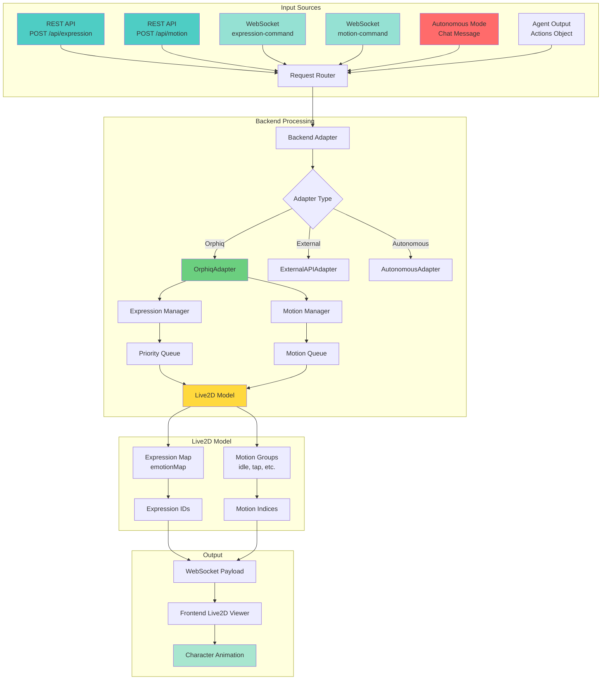
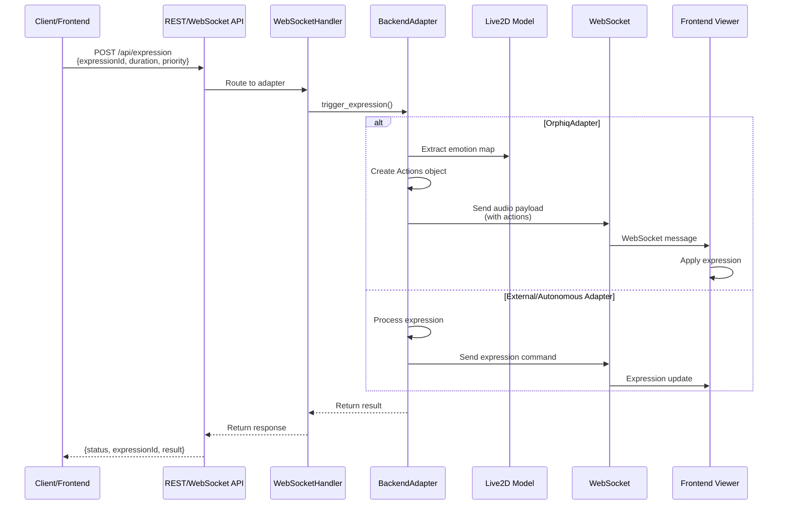
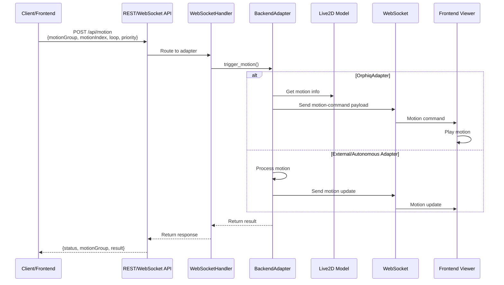
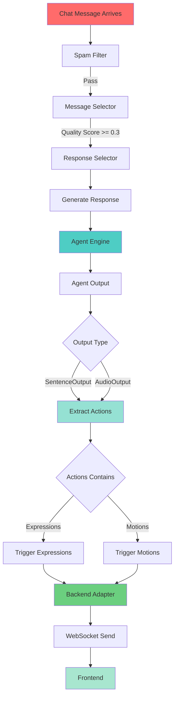
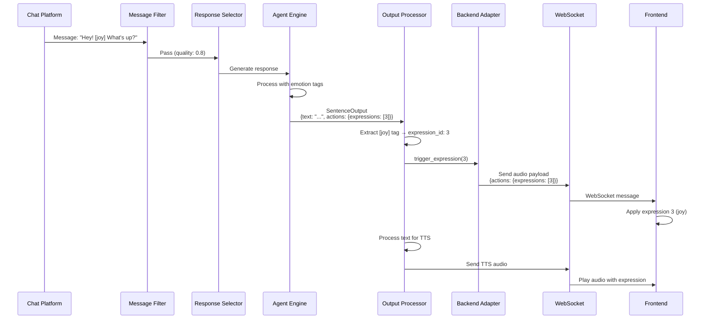
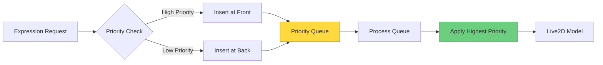
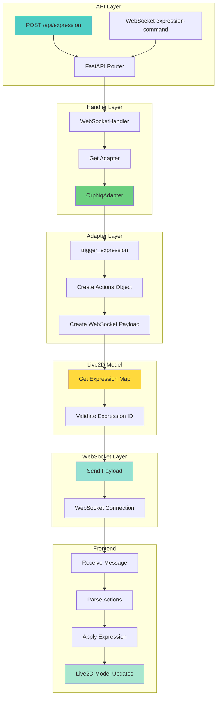
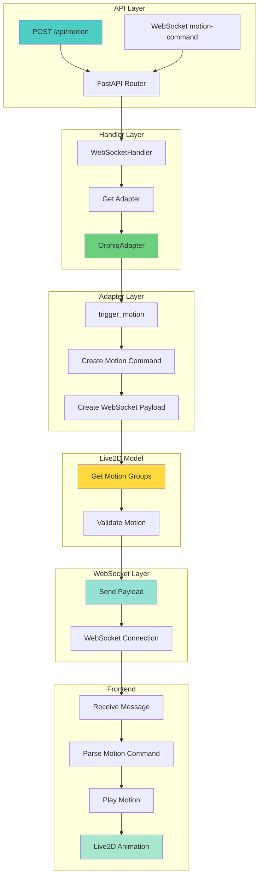

# Expression and Motion Control Architecture

## Overview

This document details how expression and motion control is implemented in the backend, including API endpoints, autonomous mode integration, priority systems, and the complete flow from request to Live2D model execution.

## System Architecture



## Expression Control System

### Expression Control Flow



### Expression Data Structures

#### Expression Request (REST API)
```json
{
  "expressionId": 3,
  "duration": 5000,
  "priority": 10,
  "client_uid": "optional-client-id"
}
```

#### Expression Request (WebSocket)
```json
{
  "type": "expression-command",
  "expression_id": 3,
  "duration": 5000,
  "priority": 10
}
```

#### Expression Response
```json
{
  "type": "expression-ack",
  "expression_id": 3,
  "result": {
    "status": "success",
    "expression_id": 3,
    "duration": 5000,
    "priority": 10
  }
}
```

### Expression Mapping System

The `Live2dModel` class maintains an emotion map that translates emotion keywords to expression IDs:

```python
# From model_dict.json
{
  "emotionMap": {
    "neutral": 0,
    "anger": 2,
    "joy": 3,
    "smirk": 3,
    "sadness": 1,
    "surprise": 3,
    "fear": 1
  }
}
```

The model can extract expressions from text using tags like `[joy]`, `[smirk]`, etc.

## Motion Control System

### Motion Control Flow



### Motion Data Structures

#### Motion Request (REST API)
```json
{
  "motionGroup": "idle",
  "motionIndex": 0,
  "loop": false,
  "priority": 5,
  "client_uid": "optional-client-id"
}
```

#### Motion Request (WebSocket)
```json
{
  "type": "motion-command",
  "motion_group": "idle",
  "motion_index": 0,
  "loop": false,
  "priority": 5
}
```

#### Motion Response
```json
{
  "type": "motion-ack",
  "motion_group": "idle",
  "motion_index": 0,
  "result": {
    "status": "success",
    "motion_group": "idle",
    "motion_index": 0,
    "loop": false,
    "priority": 5
  }
}
```

### Motion Groups

From `model_dict.json`, models support various motion groups:

- **idle**: Idle animations (continuous)
- **tap_body**: Tap body interactions
- **tap_head**: Tap head interactions
- **shake**: Shake animations
- **pinch_in/pinch_out**: Pinch gestures

## Backend API Implementation

### REST API Endpoints

#### POST /api/expression

**Location**: `backend/src/open_llm_vtuber/routes.py`

**Implementation**:
```python
@router.post("/api/expression")
async def set_expression_endpoint(
    request: ExpressionRequest,
    client_uid: str = Header(..., alias="X-Client-UID")
):
    """
    Set character expression via REST API.
    
    Request body:
    {
        "expressionId": int,  # Required: Expression ID (0-7 typically)
        "duration": int,       # Optional: Duration in milliseconds (0 = permanent)
        "priority": int        # Optional: Priority level (higher = more important)
    }
    
    Returns:
    {
        "status": str,
        "expression_id": int,
        "result": dict
    }
    """
    # Get adapter for client
    adapter = get_adapter_for_client(client_uid)
    
    # Trigger expression
    result = await adapter.trigger_expression(
        expression_id=request.expressionId,
        duration=request.duration,
        priority=request.priority
    )
    
    return {
        "status": "success",
        "expression_id": request.expressionId,
        "result": result
    }
```

**Flow**:
1. Request received with `expressionId`, `duration`, `priority`
2. Get or create adapter for client
3. Call `adapter.trigger_expression()`
4. Adapter processes and sends to WebSocket
5. Return result to client

#### POST /api/motion

**Location**: `backend/src/open_llm_vtuber/routes.py`

**Implementation**:
```python
@router.post("/api/motion")
async def trigger_motion_endpoint(
    request: MotionRequest,
    client_uid: str = Header(..., alias="X-Client-UID")
):
    """
    Trigger character motion via REST API.
    
    Request body:
    {
        "motionGroup": str,    # Required: Motion group name (e.g., "idle")
        "motionIndex": int,    # Required: Motion index within group
        "loop": bool,          # Optional: Whether to loop the motion
        "priority": int        # Optional: Priority level
    }
    
    Returns:
    {
        "status": str,
        "motion_group": str,
        "motion_index": int,
        "result": dict
    }
    """
    # Get adapter for client
    adapter = get_adapter_for_client(client_uid)
    
    # Trigger motion
    result = await adapter.trigger_motion(
        motion_group=request.motionGroup,
        motion_index=request.motionIndex,
        loop=request.loop,
        priority=request.priority
    )
    
    return {
        "status": "success",
        "motion_group": request.motionGroup,
        "motion_index": request.motionIndex,
        "result": result
    }
```

### WebSocket API Implementation

#### expression-command Handler

**Location**: `backend/src/open_llm_vtuber/websocket_handler.py`

**Implementation**:
```python
async def _handle_expression_command(
    self, websocket: WebSocket, client_uid: str, data: WSMessage
) -> None:
    """Handle expression command from client via WebSocket"""
    try:
        expression_id = data.get("expression_id")
        if expression_id is None:
            await websocket.send_text(
                json.dumps({"type": "error", "message": "expression_id is required"})
            )
            return
        
        duration = data.get("duration", 0)
        priority = data.get("priority", 0)
        
        # Get adapter for this client
        adapter = self._get_adapter(client_uid)
        
        # Trigger expression through adapter
        result = await adapter.trigger_expression(
            expression_id, duration, priority
        )
        
        # Send acknowledgment
        await websocket.send_text(
            json.dumps({
                "type": "expression-ack",
                "expression_id": expression_id,
                "result": result,
            })
        )
    except Exception as e:
        logger.error(f"Error handling expression command: {e}")
        await websocket.send_text(
            json.dumps({"type": "error", "message": str(e)})
        )
```

#### motion-command Handler

**Location**: `backend/src/open_llm_vtuber/websocket_handler.py`

**Implementation**:
```python
async def _handle_motion_command(
    self, websocket: WebSocket, client_uid: str, data: WSMessage
) -> None:
    """Handle motion command from client via WebSocket"""
    try:
        motion_group = data.get("motion_group")
        motion_index = data.get("motion_index")
        
        if motion_group is None or motion_index is None:
            await websocket.send_text(
                json.dumps({
                    "type": "error",
                    "message": "motion_group and motion_index are required",
                })
            )
            return
        
        loop = data.get("loop", False)
        priority = data.get("priority", 0)
        
        # Get adapter for this client
        adapter = self._get_adapter(client_uid)
        
        # Trigger motion through adapter
        result = await adapter.trigger_motion(
            motion_group, motion_index, loop, priority
        )
        
        # Send acknowledgment
        await websocket.send_text(
            json.dumps({
                "type": "motion-ack",
                "motion_group": motion_group,
                "motion_index": motion_index,
                "result": result,
            })
        )
    except Exception as e:
        logger.error(f"Error handling motion command: {e}")
        await websocket.send_text(
            json.dumps({"type": "error", "message": str(e)})
        )
```

## Backend Adapter Pattern

### Base Adapter Interface

**Location**: `backend/src/open_llm_vtuber/adapters/base_adapter.py`

```python
class BackendAdapter(ABC):
    """Base interface for all backend adapters"""
    
    @abstractmethod
    async def trigger_expression(
        self,
        expression_id: int,
        duration: Optional[int] = None,
        priority: int = 0,
    ) -> Dict[str, Any]:
        """
        Trigger character expression
        
        Args:
            expression_id: Expression ID to trigger
            duration: Duration in milliseconds (0 = permanent)
            priority: Priority level (higher = more important)
            
        Returns:
            dict: Result dictionary with status information
        """
        pass
    
    @abstractmethod
    async def trigger_motion(
        self,
        motion_group: str,
        motion_index: int,
        loop: bool = False,
        priority: int = 0,
    ) -> Dict[str, Any]:
        """
        Trigger character motion
        
        Args:
            motion_group: Motion group name
            motion_index: Motion index within group
            loop: Whether to loop the motion
            priority: Priority level (higher = more important)
            
        Returns:
            dict: Result dictionary with status information
        """
        pass
```

### Orphiq Adapter Implementation

**Location**: `backend/src/open_llm_vtuber/adapters/orphiq_adapter.py`

#### Expression Triggering

```python
async def trigger_expression(
    self,
    expression_id: int,
    duration: Optional[int] = None,
    priority: int = 0,
) -> Dict[str, Any]:
    """
    Trigger expression by sending action via WebSocket
    
    The OrphiqAdapter sends expressions as part of an Actions object
    embedded in an audio payload (even without audio).
    """
    try:
        # Create Actions object with expression
        from ..agent.output_types import Actions
        actions = Actions(expressions=[expression_id])
        
        # Create WebSocket payload
        payload = {
            "type": "audio",
            "audio": None,  # No audio, just expression
            "volumes": [],
            "slice_length": 20,
            "display_text": {
                "text": f"Expression {expression_id}",
                "name": self.context.character_config.character_name,
                "avatar": self.context.character_config.avatar,
            },
            "actions": actions.to_dict(),
            "forwarded": False,
        }
        
        # Send via WebSocket
        await self.websocket_send(json.dumps(payload))
        
        # Track current expression
        self._current_expression = expression_id
        
        return {
            "status": "success",
            "expression_id": expression_id,
            "duration": duration,
            "priority": priority,
        }
    except Exception as e:
        logger.error(f"Error triggering expression: {e}")
        return {"status": "error", "error": str(e)}
```

#### Motion Triggering

```python
async def trigger_motion(
    self,
    motion_group: str,
    motion_index: int,
    loop: bool = False,
    priority: int = 0,
) -> Dict[str, Any]:
    """
    Trigger motion by sending motion command via WebSocket
    """
    try:
        # Create motion command payload
        payload = {
            "type": "motion-command",
            "motion_group": motion_group,
            "motion_index": motion_index,
            "loop": loop,
            "priority": priority,
        }
        
        # Send via WebSocket
        await self.websocket_send(json.dumps(payload))
        
        # Track current motion
        self._current_motion = {
            "group": motion_group,
            "index": motion_index,
            "loop": loop,
        }
        
        return {
            "status": "success",
            "motion_group": motion_group,
            "motion_index": motion_index,
            "loop": loop,
            "priority": priority,
        }
    except Exception as e:
        logger.error(f"Error triggering motion: {e}")
        return {"status": "error", "error": str(e)}
```

## Integration with Autonomous Mode

### Autonomous Expression/Motion Triggering



### Agent Output Integration

**Location**: `backend/src/open_llm_vtuber/agent/output_types.py`

The agent can output expressions and motions as part of the `Actions` object:

```python
@dataclass
class Actions:
    """Represents actions that can be performed alongside text output"""
    expressions: Optional[List[str] | List[int]] = None
    pictures: Optional[List[str]] = None
    sounds: Optional[List[str]] = None
```

**Processing Flow**:

1. **Agent generates response** with `SentenceOutput` or `AudioOutput`
2. **Output contains `actions`** field with expressions/motions
3. **Conversation utils process actions**:
   ```python
   async for display_text, tts_text, actions in output:
       await tts_manager.speak(
           tts_text=tts_text,
           display_text=display_text,
           actions=actions,  # Contains expressions/motions
           live2d_model=live2d_model,
           tts_engine=tts_engine,
           websocket_send=websocket_send,
       )
   ```
4. **TTS Manager sends actions** via WebSocket payload
5. **Frontend receives and applies** expressions/motions

### Chat Message to Expression/Motion Flow



## Priority System (Future Implementation)

### Expression Priority Queue



### Priority Implementation (Planned)

**Location**: `backend/src/open_llm_vtuber/chat_platforms/message_filters.py` (for reference)

The priority system would work as follows:

```python
class ExpressionManager:
    def __init__(self):
        self.active_expressions: Dict[int, ExpressionState] = {}
        self.priority_queue: List[ExpressionState] = []
    
    async def set_expression(
        self,
        expression_id: int,
        duration: Optional[int] = None,
        priority: int = 0
    ):
        """Set expression with priority"""
        state = ExpressionState(
            id=expression_id,
            duration=duration,
            priority=priority,
            start_time=time.time()
        )
        
        # Insert based on priority
        self.priority_queue.append(state)
        self.priority_queue.sort(key=lambda x: x.priority, reverse=True)
        
        # Apply highest priority expression
        if self.priority_queue:
            top_expression = self.priority_queue[0]
            await self._apply_expression(top_expression.id)
```

**Priority Levels**:
- **0-4**: Low priority (user interactions, idle)
- **5-9**: Medium priority (chat responses, autonomous)
- **10-19**: High priority (important events, mentions)
- **20+**: Critical priority (system events, alerts)

## Live2D Model Integration

### Model Information Structure

**Location**: `backend/src/open_llm_vtuber/live2d_model.py`

```python
class Live2dModel:
    """
    Represents a Live2D model configuration.
    Does NOT send data to frontend - only prepares information.
    """
    
    def __init__(self, live2d_model_name: str, model_dict_path: str = "model_dict.json"):
        self.model_dict_path = model_dict_path
        self.live2d_model_name = live2d_model_name
        self.set_model(live2d_model_name)
    
    def set_model(self, model_name: str) -> None:
        """Load model information from model_dict.json"""
        self.model_info = self._lookup_model_info(model_name)
        self.emo_map = {
            k.lower(): v 
            for k, v in self.model_info["emotionMap"].items()
        }
        self.emo_str = " ".join([f"[{key}]," for key in self.emo_map.keys()])
    
    def extract_emotion(self, str_to_check: str) -> list:
        """
        Extract emotion tags from text and return expression IDs.
        
        Example:
            "Hello [joy] there!" → [3]
            "I'm [sadness] and [anger]" → [1, 2]
        """
        expression_list = []
        str_to_check = str_to_check.lower()
        
        i = 0
        while i < len(str_to_check):
            if str_to_check[i] != "[":
                i += 1
                continue
            for key in self.emo_map.keys():
                emo_tag = f"[{key}]"
                if str_to_check[i : i + len(emo_tag)] == emo_tag:
                    expression_list.append(self.emo_map[key])
                    i += len(emo_tag) - 1
                    break
            i += 1
        return expression_list
```

### Expression Extraction from Text

The system can automatically extract expressions from agent-generated text:

```python
# Agent generates: "Hello! [joy] I'm so happy to see you!"
# Live2D model extracts: [joy] → expression_id: 3
# Actions object created: Actions(expressions=[3])
# Sent to frontend via WebSocket
```

## Complete Backend Flow

### End-to-End Expression Control Flow



### End-to-End Motion Control Flow



## Autonomous Mode Integration

### Chat Message Processing with Expressions/Motions

**Location**: `backend/src/open_llm_vtuber/routes.py`

```python
async def _process_chat_message_for_autonomous(
    context_cache: ServiceContext,
    chat_message: ChatMessage,
    context: Dict[str, Any]
) -> None:
    """
    Process chat message and generate response with expressions/motions.
    """
    # ... filtering and selection ...
    
    # Generate response
    selected_response = await response_selector.select_best_response(...)
    
    if selected_response:
        # Create batch input for agent
        batch_input = create_batch_input(
            input_text=selected_response,
            images=None,
            from_name=chat_message.username,
        )
        
        # Generate agent output (includes actions)
        agent_output = context_cache.agent_engine.chat(batch_input)
        
        # Process output - expressions/motions extracted automatically
        async for output in agent_output:
            if isinstance(output, SentenceOutput):
                # Output contains actions with expressions/motions
                actions = output.actions
                
                # Send to WebSocket with actions
                await process_agent_output(
                    output=output,
                    character_config=context_cache.character_config,
                    live2d_model=context_cache.live2d_model,
                    tts_engine=context_cache.tts_engine,
                    websocket_send=websocket_send,
                    tts_manager=tts_manager,
                )
```

### Expression/Motion from Agent Text

The agent can generate text with emotion tags that are automatically converted to expressions:

```python
# Agent generates: "I'm so [joy] happy! [smirk]"
# Live2D model extracts: [joy] → 3, [smirk] → 3
# Actions created: Actions(expressions=[3, 3])
# Sent to frontend with text and audio
```

## WebSocket Payload Structure

### Expression Payload

```json
{
  "type": "audio",
  "audio": null,
  "volumes": [],
  "slice_length": 20,
  "display_text": {
    "text": "Expression 3",
    "name": "CharacterName",
    "avatar": "/avatars/character.png"
  },
  "actions": {
    "expressions": [3]
  },
  "forwarded": false
}
```

### Motion Payload

```json
{
  "type": "motion-command",
  "motion_group": "idle",
  "motion_index": 0,
  "loop": false,
  "priority": 5
}
```

### Combined Payload (Expression + Motion + Audio)

```json
{
  "type": "audio",
  "audio": "base64_encoded_audio_data",
  "volumes": [0.5, 0.6, 0.7],
  "slice_length": 20,
  "display_text": {
    "text": "Hello! [joy]",
    "name": "CharacterName",
    "avatar": "/avatars/character.png"
  },
  "actions": {
    "expressions": [3],
    "motions": [{"group": "idle", "index": 0}]
  },
  "forwarded": false
}
```

## Frontend Integration (Overview)

### WebSocket Message Handling

The frontend receives WebSocket messages and processes them:

```javascript
// Frontend receives message
{
  type: "audio",
  actions: {
    expressions: [3]
  }
}

// Frontend applies expression
if (data.actions && data.actions.expressions) {
  data.actions.expressions.forEach(exprId => {
    model.internalModel.setExpression(exprId);
  });
}
```

### Live2D Model API

The frontend uses the Live2D SDK to apply expressions and motions:

- **Expressions**: `model.internalModel.setExpression(expressionId)`
- **Motions**: `model.motionManager.startMotion(motionGroup, motionIndex, loop)`

## Implementation Status

### ✅ Implemented

1. **REST API Endpoints**: `/api/expression` and `/api/motion` (structure exists)
2. **WebSocket Handlers**: `expression-command` and `motion-command` handlers
3. **Backend Adapter Pattern**: Base interface and OrphiqAdapter implementation
4. **Live2D Model Class**: Expression extraction and emotion mapping
5. **Agent Output Integration**: Actions object with expressions/motions
6. **Autonomous Mode Integration**: Chat messages can trigger expressions/motions

### 🚧 Partially Implemented

1. **Priority System**: Defined in interfaces but not fully implemented in queue
2. **Duration Management**: Duration parameter exists but not enforced
3. **Motion Queue**: Structure exists but not fully implemented

### 📋 Planned

1. **Expression Manager**: Priority-based expression queue
2. **Motion Manager**: Motion queue with priority and loop management
3. **Duration Timers**: Automatic expression/motion expiration
4. **Conflict Resolution**: Handle overlapping expressions/motions
5. **REST API Endpoints**: Full implementation with proper routing

## Configuration

### Model Dictionary Structure

**Location**: `backend/model_dict.json`

```json
{
  "name": "shizuku-local",
  "emotionMap": {
    "neutral": 0,
    "anger": 2,
    "joy": 3,
    "smirk": 3,
    "sadness": 1,
    "surprise": 3
  },
  "idleMotionGroupName": "idle",
  "tapMotions": {
    "body": {
      "tap_body": 30,
      "shake": 30
    },
    "head": {
      "flick_head": 40,
      "shake": 20
    }
  }
}
```

## Error Handling

### Expression Errors

- **Invalid Expression ID**: Returns error if expression_id not in model's emotionMap
- **Missing Parameters**: Returns 400 error if required parameters missing
- **Adapter Errors**: Logs error and returns error status

### Motion Errors

- **Invalid Motion Group**: Returns error if motion_group not found
- **Invalid Motion Index**: Returns error if motion_index out of range
- **Missing Parameters**: Returns 400 error if required parameters missing

## Performance Considerations

1. **WebSocket Efficiency**: Expressions/motions sent as part of audio payloads to reduce messages
2. **Caching**: Model information cached in `Live2dModel` instance
3. **Async Processing**: All operations are async to avoid blocking
4. **Priority Queue**: Future implementation will use efficient priority queue

## Future Enhancements

1. **Expression Blending**: Smooth transitions between expressions
2. **Motion Sequencing**: Chain multiple motions together
3. **Context-Aware Expressions**: Adjust expressions based on conversation context
4. **Emotion State Machine**: Track emotional state over time
5. **Custom Expression Triggers**: User-defined triggers for expressions/motions
6. **Expression Intensity**: Support for expression intensity levels
7. **Motion Speed Control**: Adjustable motion playback speed

## Testing

### Manual Testing

1. **REST API**: Use `curl` or Postman to test endpoints
2. **WebSocket**: Use WebSocket client to send commands
3. **Autonomous Mode**: Send chat messages and observe expressions/motions

### Test Endpoints

```bash
# Test expression
curl -X POST http://localhost:12393/api/expression \
  -H "Content-Type: application/json" \
  -H "X-Client-UID: test-client" \
  -d '{"expressionId": 3, "duration": 5000, "priority": 10}'

# Test motion
curl -X POST http://localhost:12393/api/motion \
  -H "Content-Type: application/json" \
  -H "X-Client-UID: test-client" \
  -d '{"motionGroup": "idle", "motionIndex": 0, "loop": false, "priority": 5}'
```

## Summary

The expression and motion control system provides:

1. **Multiple Input Methods**: REST API, WebSocket, and autonomous mode
2. **Unified Adapter Pattern**: Consistent interface across backend types
3. **Automatic Extraction**: Expressions extracted from agent text
4. **Priority Support**: Framework for priority-based control
5. **Live2D Integration**: Direct mapping to Live2D model capabilities
6. **Frontend Communication**: WebSocket-based real-time updates

The system is designed to be extensible, allowing for future enhancements like priority queues, duration management, and advanced motion sequencing.

