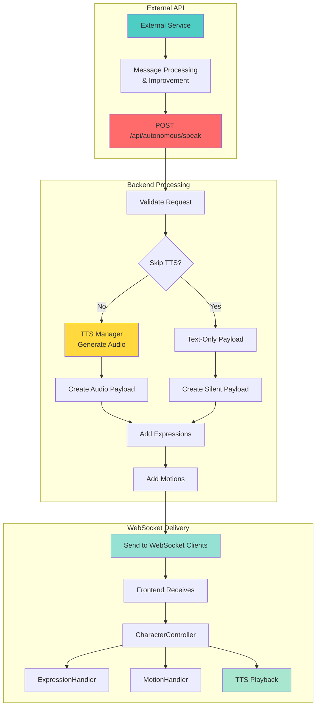
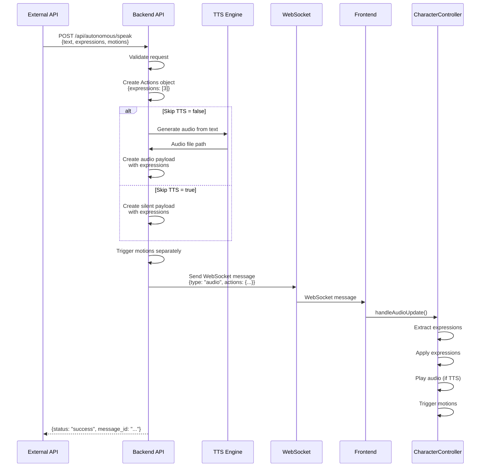

# External API Autonomous Mode

## Overview

The External API Autonomous Mode allows external services to send messages directly to the autonomous mode system, enabling external APIs to control what the character says, along with expressions and motions. This is designed for services that want to pre-process, improve, or generate messages before sending them to the character.

## Architecture



## API Endpoint

### POST /api/autonomous/speak

**Purpose**: Send messages from external APIs to autonomous mode with expressions and motions.

**Request Body**:
```json
{
  "text": "Hello everyone! I'm so excited to be here!",
  "expressions": [3, 3],
  "motions": [
    {
      "group": "idle",
      "index": 0,
      "loop": false,
      "priority": 5
    }
  ],
  "client_uid": "default",
  "skip_tts": false,
  "metadata": {
    "source": "external_api",
    "improved": true,
    "confidence": 0.95
  }
}
```

**Response**:
```json
{
  "status": "success",
  "message_id": "550e8400-e29b-41d4-a716-446655440000",
  "text": "Hello everyone! I'm so excited to be here!",
  "expressions": [3, 3],
  "motions": ["idle/0"],
  "tts_generated": true,
  "metadata": {
    "source": "external_api",
    "improved": true,
    "confidence": 0.95
  }
}
```

## Request Parameters

### Required Parameters

- **`text`** (string, optional if expressions/motions provided): The message text for the character to speak. This is the primary content that will be processed through TTS (unless `skip_tts` is true). 
  - Required if `skip_tts` is false
  - Optional if `skip_tts` is true and expressions/motions are provided
  - At least one of `text`, `expressions`, or `motions` must be provided

### Optional Parameters

- **`expressions`** (array of integers): List of expression IDs to apply when speaking. Multiple expressions can be specified, and they will be applied in sequence.
  - Example: `[3, 3]` applies expression 3 twice
  - Example: `[1, 3]` applies expression 1, then expression 3

- **`motions`** (array of objects): List of motions to trigger. Each motion object contains:
  - `group` (string): Motion group name (e.g., "idle", "tap_body")
  - `index` (int): Motion index within the group
  - `loop` (bool): Whether to loop the motion (default: false)
  - `priority` (int): Motion priority level (default: 0)

- **`client_uid`** (string): Target client UID for the message. If not specified, defaults to "default". If the client doesn't exist, a new context will be created.

- **`skip_tts`** (bool): If true, skip TTS generation and only send the text with expressions/motions. Useful for silent expressions or when audio is handled externally. Default: false.

- **`metadata`** (object): Additional metadata for the message. This can include information about the source, processing steps, confidence scores, etc. The metadata is returned in the response.

## Use Cases

### 1. Message Improvement Service

An external API can receive raw messages, improve them (grammar, style, personality), and send them back:

```python
import requests

# External API receives message
raw_message = "hey whats up"

# Process and improve message
improved_message = improve_message(raw_message, personality="excited")

# Send to autonomous mode
response = requests.post(
    "http://localhost:12393/api/autonomous/speak",
    json={
        "text": improved_message,
        "expressions": [3],  # Joy expression
        "metadata": {
            "source": "message_improver",
            "original": raw_message,
            "improved": True
        }
    }
)
```

### 2. AI Content Generator

An external AI service generates contextual responses:

```python
# Generate response based on context
context = {
    "viewer_count": 150,
    "recent_messages": [...],
    "stream_topic": "gaming"
}

response_text = ai_generate_response(context)

# Send with appropriate expressions
requests.post(
    "http://localhost:12393/api/autonomous/speak",
    json={
        "text": response_text,
        "expressions": [3],  # Happy
        "motions": [{"group": "idle", "index": 0}],
        "metadata": {
            "source": "ai_generator",
            "context": context
        }
    }
)
```

### 3. Expression-Only Control

Send expressions without text (useful for reactions):

```python
# React to an event with expression only
requests.post(
    "http://localhost:12393/api/autonomous/speak",
    json={
        "expressions": [2],  # Surprise expression
        "skip_tts": True,  # Skip TTS since no text
        "metadata": {
            "source": "event_reactor",
            "event": "new_follower"
        }
    }
)
```

Note: When `skip_tts` is true, the `text` parameter is optional. You can send expressions and/or motions without any text.

### 4. Motion Sequences

Trigger complex motion sequences:

```python
# Welcome sequence with multiple motions
requests.post(
    "http://localhost:12393/api/autonomous/speak",
    json={
        "text": "Welcome to the stream!",
        "expressions": [3],  # Happy
        "motions": [
            {"group": "tap_body", "index": 0, "loop": False},
            {"group": "idle", "index": 0, "loop": True}
        ],
        "metadata": {
            "source": "welcome_bot",
            "sequence": "welcome"
        }
    }
)
```

## Complete Flow



## Integration with Existing Systems

### Expression Handling

Expressions are processed through the existing `Actions` object:

```python
from ..agent.output_types import Actions

actions = Actions(expressions=[3, 3])
# Sent via WebSocket payload
```

The frontend `ExpressionHandler` receives and applies these expressions automatically.

### Motion Handling

Motions are triggered separately through the adapter system:

```python
adapter = ws_handler._get_adapter(client_uid)
result = await adapter.trigger_motion(
    motion_group="idle",
    motion_index=0,
    loop=False,
    priority=5
)
```

### TTS Integration

If `skip_tts` is false, the message goes through the TTS system:

```python
tts_manager = TTSTaskManager()
await tts_manager.speak(
    tts_text=text,
    display_text=display_text,
    actions=actions,
    live2d_model=context.live2d_model,
    tts_engine=context.tts_engine,
    websocket_send=websocket_send,
)
```

## Error Handling

### Validation Errors (400)

- Missing `text` parameter
- Invalid expression IDs
- Invalid motion format

### Server Errors (500)

- TTS generation failure
- WebSocket connection issues
- Context creation failures

## Best Practices

### 1. Message Quality

External APIs should focus on:
- **Grammar and style**: Ensure messages are grammatically correct
- **Personality consistency**: Match the character's persona
- **Context awareness**: Consider stream context, viewer count, etc.
- **Length**: Keep messages concise for better engagement

### 2. Expression Selection

- **Match emotion**: Use expressions that match the message tone
- **Avoid overuse**: Don't apply expressions to every message
- **Sequence appropriately**: Multiple expressions can create transitions

### 3. Motion Timing

- **Coordinate with text**: Motions should complement the message
- **Avoid conflicts**: Don't trigger conflicting motions simultaneously
- **Use priorities**: Higher priority motions override lower ones

### 4. Performance

- **Batch operations**: Send multiple messages efficiently
- **Rate limiting**: Respect backend rate limits
- **Error handling**: Implement retry logic for failed requests

## Example External API Service

```python
from flask import Flask, request
import requests

app = Flask(__name__)
VTUBER_API_URL = "http://localhost:12393/api/autonomous/speak"

def improve_message(text: str) -> str:
    """Improve message grammar and style"""
    # Your improvement logic here
    improved = text.capitalize() + "!"
    return improved

def select_expression(text: str) -> list:
    """Select appropriate expression based on text sentiment"""
    if "happy" in text.lower() or "excited" in text.lower():
        return [3]  # Joy
    elif "sad" in text.lower():
        return [1]  # Sadness
    return []

@app.route('/process_message', methods=['POST'])
def process_message():
    data = request.json
    raw_text = data.get('text', '')
    
    # Improve message
    improved_text = improve_message(raw_text)
    
    # Select expression
    expressions = select_expression(improved_text)
    
    # Send to autonomous mode
    response = requests.post(
        VTUBER_API_URL,
        json={
            "text": improved_text,
            "expressions": expressions,
            "metadata": {
                "source": "message_processor",
                "original": raw_text,
                "improved": True
            }
        }
    )
    
    return response.json()

if __name__ == '__main__':
    app.run(port=5000)
```

## Comparison with Other Endpoints

### vs. `/api/autonomous/generate`

- **`/api/autonomous/generate`**: Generates text using the agent engine (internal)
- **`/api/autonomous/speak`**: Accepts pre-generated text from external APIs

### vs. `/api/expression` and `/api/motion`

- **`/api/expression`** and **`/api/motion`**: Control expressions/motions only
- **`/api/autonomous/speak`**: Combines text, expressions, and motions in one request

### vs. WebSocket `text-input`

- **WebSocket `text-input`**: User-initiated conversation
- **`/api/autonomous/speak`**: Programmatic control from external services

## Security Considerations

1. **Authentication**: Consider adding API key authentication for production
2. **Rate Limiting**: Implement rate limiting to prevent abuse
3. **Input Validation**: All inputs are validated before processing
4. **Client Isolation**: Messages are sent to specific client UIDs

## Future Enhancements

1. **Webhook Support**: Allow external APIs to receive callbacks
2. **Message Queue**: Support for queuing messages
3. **Batch Operations**: Send multiple messages in one request
4. **Scheduling**: Schedule messages for future delivery
5. **Analytics**: Track message performance and engagement

## Testing

### Example cURL Request

```bash
curl -X POST http://localhost:12393/api/autonomous/speak \
  -H "Content-Type: application/json" \
  -d '{
    "text": "Hello from external API!",
    "expressions": [3],
    "motions": [{"group": "idle", "index": 0}],
    "metadata": {"source": "test"}
  }'
```

### Expected Response

```json
{
  "status": "success",
  "message_id": "...",
  "text": "Hello from external API!",
  "expressions": [3],
  "motions": ["idle/0"],
  "tts_generated": true,
  "metadata": {"source": "test"}
}
```

## Summary

The External API Autonomous Mode provides a powerful interface for external services to control the character's speech, expressions, and motions. This enables:

- **Message improvement**: External APIs can enhance messages before sending
- **AI integration**: Connect with external AI services for content generation
- **Event reactions**: Trigger expressions and motions based on external events
- **Complex sequences**: Coordinate text, expressions, and motions together

The endpoint is designed to be flexible, allowing external APIs to work with or without TTS, with or without expressions/motions, making it suitable for a wide range of use cases.

