# Microphone Audio Flow: Frontend to Backend

This document describes the complete lifecycle of microphone audio from capture in the frontend to transcription and processing in the backend.

## Overview

The microphone audio flow involves:
1. **Frontend**: Microphone capture, audio processing, and WebSocket transmission
2. **Backend**: Audio buffering, transcription, and conversation processing

**Current Issue**: Microphone turns on but audio doesn't stream to backend and isn't transcribed.

## Complete Flow Diagram


## Detailed Component Flow

### 1. Frontend: User Interaction (VTuberUI.tsx)

**Location**: `frontend/app/(app)/aidol/components/VTuberUI.tsx`

**Flow**:
1. User clicks microphone button in `ChatInput.tsx`
2. `onMicrophoneToggle` prop called
3. Calls `handleMicrophoneToggle` from `ModelContext`

**Code**:
```typescript
// VTuberUI.tsx:377-380
const handleMicToggle = async () => {
  await handleMicrophoneToggle();
};
```

**Initial Permission Request** (VTuberUI.tsx:88-110):
- Checks microphone permissions on component mount
- Requests permissions if not granted
- **Note**: This is proactive but doesn't guarantee stream access

### 2. Frontend: ModelContext Handler (ModelContext.tsx)

**Location**: `frontend/app/(app)/aidol/components/contexts/ModelContext.tsx`

**Flow**:
1. `handleMicrophoneToggle` callback receives current state
2. Delegates to `CharacterHandler.handleMicrophoneToggle`

**Code**:
```typescript
// ModelContext.tsx:437-446
const handleMicrophoneToggle = useCallback(async () => {
  if (characterHandlerRef.current) {
    await characterHandlerRef.current.handleMicrophoneToggle(
      isRecording,
      audioPermissionGranted,
      audioStream
    );
    setIsRecording(!isRecording);
  }
}, [isRecording, audioPermissionGranted, audioStream]);
```

**State Management**:
- `isRecording`: Boolean state for recording status
- `audioPermissionGranted`: Boolean state for permission status
- `audioStream`: MediaStream object reference

**Potential Issues**:
- ⚠️ **State Update Timing**: `setIsRecording(!isRecording)` happens AFTER async call completes
- ⚠️ **Stale State**: Callback dependencies might cause stale closures
- ⚠️ **Error Handling**: Errors in CharacterHandler don't update state properly

### 3. Frontend: CharacterHandler Microphone Toggle (CharacterController.ts)

**Location**: `frontend/app/(app)/aidol/components/contexts/character/CharacterController.ts`

**Flow** (lines 830-856):
1. If NOT recording:
   - Check if permissions granted
   - If not, request `getUserMedia({ audio: true })`
   - Set audio stream and permissions
   - Call `setupAudioProcessing(stream)`
   - Set `isRecording = true`
2. If recording:
   - Call `stopAudioProcessing()`
   - Stop all audio tracks
   - Clear audio stream
   - Set `isRecording = false`

**Code**:
```typescript
// CharacterController.ts:830-856
async handleMicrophoneToggle(isRecording: boolean, audioPermissionGranted: boolean, audioStream: MediaStream | null): Promise<void> {
  try {
    if (!isRecording) {
      if (!audioPermissionGranted) {
        const stream = await navigator.mediaDevices.getUserMedia({ audio: true });
        this.props.setAudioPermissionGranted(true);
        this.props.setAudioStream(stream);
        await this.setupAudioProcessing(stream);
      } else if (audioStream) {
        await this.setupAudioProcessing(audioStream);
      }
      this.props.setIsRecording(true);
    } else {
      this.stopAudioProcessing();
      if (audioStream) {
        audioStream.getTracks().forEach(track => track.stop());
        this.props.setAudioStream(null);
      }
      this.props.setIsRecording(false);
    }
  } catch (error) {
    console.error('[CharacterHandler] Error accessing microphone:', error);
    this.props.setIsRecording(false);
    this.props.setAudioPermissionGranted(false);
  }
}
```

**Potential Issues**:
- ⚠️ **Missing Stream Check**: If `audioPermissionGranted` is true but `audioStream` is null, nothing happens
- ⚠️ **State Sync**: `setIsRecording(true)` called AFTER `setupAudioProcessing` completes, but processing might fail
- ⚠️ **Error Recovery**: If `setupAudioProcessing` fails, state might be inconsistent

### 4. Frontend: Audio Processing Setup (CharacterController.ts)

**Location**: `frontend/app/(app)/aidol/components/contexts/character/CharacterController.ts:858-946`

**Flow**:
1. Clean up existing processing
2. Get or create AudioContext
3. Resume AudioContext if suspended
4. Validate MediaStream
5. Create MediaStreamSource
6. Create ScriptProcessorNode (4096 buffer size, 1 input, 1 output)
7. Set up `onaudioprocess` callback
8. Connect source → processor → destination
9. Start silence detection

**Key Configuration**:
- `sampleRate`: 16000 Hz (default)
- `bufferSize`: 4096 samples
- Processing threshold: 2 chunks (8192 samples total)

**Code**:
```typescript
// CharacterController.ts:904-932
const source = this.audioContext.createMediaStreamSource(stream);
this.streamProcessor = this.audioContext.createScriptProcessor(this.bufferSize, 1, 1);

this.streamProcessor.onaudioprocess = (e) => {
  if (!this.isProcessing) {
    this.isProcessing = true;
    try {
      const inputData = e.inputBuffer.getChannelData(0);
      const float32Array = new Float32Array(inputData);
      
      const currentVolume = this.calculateVolume(float32Array);
      this.updateVolumeHistory(currentVolume);
      
      this.audioBuffer.push(float32Array);
      
      // Process buffer if it reaches 2 chunks
      if (this.audioBuffer.length >= 2) {
        this.processAudioBuffer();
      }
    } catch (error) {
      console.error('[CharacterHandler] Error in audio processing callback:', error);
    } finally {
      this.isProcessing = false;
    }
  }
};

source.connect(this.streamProcessor);
this.streamProcessor.connect(this.audioContext.destination);
```

**Potential Issues**:
- ⚠️ **ScriptProcessor Deprecation**: ScriptProcessorNode is deprecated (should use AudioWorklet)
- ⚠️ **Processing Guard**: `isProcessing` flag might prevent processing if callback takes too long
- ⚠️ **Buffer Size**: 2 chunks = 8192 samples = ~0.5 seconds at 16kHz (might be too infrequent)
- ⚠️ **Connection Issue**: Connecting processor to `audioContext.destination` causes feedback/echo

### 5. Frontend: Audio Buffer Processing (CharacterController.ts)

**Location**: `frontend/app/(app)/aidol/components/contexts/character/CharacterController.ts:1002-1033`

**Flow**:
1. Combine buffered chunks into single Float32Array
2. Send via `sendAudioData()`
3. Clear buffer

**Code**:
```typescript
// CharacterController.ts:1002-1033
private processAudioBuffer(): void {
  if (this.audioBuffer.length === 0) return;
  
  // Combine chunks into a single array
  const totalLength = this.audioBuffer.length * this.bufferSize;
  const combinedBuffer = new Float32Array(totalLength);
  
  let offset = 0;
  for (const chunk of this.audioBuffer) {
    combinedBuffer.set(chunk, offset);
    offset += chunk.length;
  }
  
  // Send the combined buffer
  this.sendAudioData(combinedBuffer);
  
  // Clear the buffer
  this.audioBuffer = [];
}
```

### 6. Frontend: Audio Data Transmission (CharacterController.ts)

**Location**: `frontend/app/(app)/aidol/components/contexts/character/CharacterController.ts:1035-1066`

**Flow**:
1. Check WebSocket connection
2. Normalize audio data
3. Convert Float32Array to regular Array (for JSON)
4. Send via WebSocket with message type `mic-audio-data`

**Code**:
```typescript
// CharacterController.ts:1035-1066
private sendAudioData(audioData: Float32Array): void {
  if (!this.props.isConnected) {
    console.warn('[CharacterHandler] Cannot send audio data: WebSocket not connected');
    return;
  }
  
  const normalizedData = this.normalizeAudioData(audioData);
  const audioArray = Array.from(normalizedData);
  
  this.props.sendMessage({
    type: 'mic-audio-data',
    audio: audioArray,
    sampleRate: this.sampleRate,
    bufferSize: this.bufferSize
  });
}
```

**Message Format**:
```json
{
  "type": "mic-audio-data",
  "audio": [0.123, -0.456, 0.789, ...],  // Array of floats
  "sampleRate": 16000,
  "bufferSize": 4096
}
```

**Potential Issues**:
- ⚠️ **Connection Check**: If WebSocket disconnects, audio is silently dropped
- ⚠️ **No Retry**: Failed sends aren't queued or retried
- ⚠️ **Large Payloads**: Sending arrays of floats can be large (8192 floats = ~32KB per message)

### 7. Frontend: Silence Detection & End Signal (CharacterController.ts)

**Location**: `frontend/app/(app)/aidol/components/contexts/character/CharacterController.ts:969-1000`

**Flow**:
1. Monitor volume history
2. If silence detected for `silenceDuration` (default: 2000ms)
3. Send `mic-audio-end` message
4. Stop processing and set `isRecording = false`

**Code**:
```typescript
// CharacterController.ts:969-984
private startSilenceDetection(): void {
  this.lastAudioTime = Date.now();
  this.silenceCheckTimer = setInterval(() => {
    const currentTime = Date.now();
    const movingAverage = this.getMovingAverageVolume();
    
    if (movingAverage < this.silenceThreshold) {
      if (currentTime - this.lastAudioTime >= this.silenceDuration) {
        this.sendMicAudioEnd();
      }
    } else {
      this.lastAudioTime = currentTime;
    }
  }, this.silenceCheckInterval);
}

// CharacterController.ts:986-1000
private sendMicAudioEnd(): void {
  if (!this.props.isConnected) {
    console.warn('[CharacterHandler] Cannot send mic-audio-end: WebSocket not connected');
    return;
  }
  
  this.props.sendMessage({
    type: 'mic-audio-end'
  });
  
  this.stopAudioProcessing();
  this.props.setIsRecording(false);
}
```

**Potential Issues**:
- ⚠️ **Silence Threshold**: Default threshold might be too sensitive or not sensitive enough
- ⚠️ **Auto-Stop**: Automatically stops recording on silence, user might not expect this
- ⚠️ **No Manual End**: User can't manually end recording (only silence detection)

### 8. Frontend: WebSocket Transmission (WebSocketContext.tsx)

**Location**: `frontend/app/(app)/aidol/components/contexts/WebSocketContext.tsx`

**Flow**:
1. `sendMessage` function checks WebSocket state
2. If OPEN: Send immediately via `socket.send(JSON.stringify(message))`
3. If not OPEN: Queue message for later

**Code**:
```typescript
// WebSocketContext.tsx:427-435
const sendMessage = useCallback((message: WebSocketMessage) => {
  if (socket && socket.readyState === WebSocket.OPEN) {
    console.log('Sending message:', message);
    socket.send(JSON.stringify(message));
  } else {
    console.log('Queueing message due to disconnected socket:', message);
    setMessageQueue(prev => [...prev, message]);
  }
}, [socket]);
```

**Potential Issues**:
- ⚠️ **Queue Not Processed**: Queued messages might not be sent when connection re-establishes
- ⚠️ **No Error Handling**: Failed sends aren't logged or handled
- ⚠️ **Message Size**: Large audio arrays might exceed WebSocket message size limits

### 9. Backend: WebSocket Reception (websocket_handler.py)

**Location**: `backend/src/open_llm_vtuber/websocket_handler.py`

**Message Routing** (lines 90-107):
```python
self.message_handlers = {
    "mic-audio-data": self._handle_audio_data,
    "mic-audio-end": self._handle_conversation_trigger,
    # ... other handlers
}
```

**Audio Data Handler** (lines 461-475):
```python
async def _handle_audio_data(
    self, websocket: WebSocket, client_uid: str, data: WSMessage
) -> None:
    """Handle incoming audio data"""
    logger.info(f"Received audio data for client {client_uid}")
    logger.info(f"Audio data length: {len(data.get('audio', []))}")
    logger.info(f"Current buffer size: {len(self.received_data_buffers[client_uid])}")
    
    audio_data = data.get("audio", [])
    if audio_data:
        self.received_data_buffers[client_uid] = np.append(
            self.received_data_buffers[client_uid],
            np.array(audio_data, dtype=np.float32),
        )
        logger.info(f"Updated buffer size: {len(self.received_data_buffers[client_uid])}")
```

**Flow**:
1. Extract `audio` array from message
2. Convert to numpy array (float32)
3. Append to `received_data_buffers[client_uid]`
4. Log buffer size

**Potential Issues**:
- ⚠️ **No Validation**: Doesn't validate audio data format or sample rate
- ⚠️ **Buffer Growth**: Buffer grows indefinitely until `mic-audio-end` received
- ⚠️ **Memory Leak**: If `mic-audio-end` never received, buffer keeps growing
- ⚠️ **No Error Handling**: Invalid audio data might cause crashes

### 10. Backend: Conversation Trigger (websocket_handler.py)

**Location**: `backend/src/open_llm_vtuber/websocket_handler.py:506-522`

**Flow**:
1. `mic-audio-end` message received
2. Routes to `_handle_conversation_trigger`
3. Calls `handle_conversation_trigger` from `conversation_handler.py`

**Code**:
```python
# websocket_handler.py:506-522
async def _handle_conversation_trigger(
    self, websocket: WebSocket, client_uid: str, data: WSMessage
) -> None:
    """Handle triggers that start a conversation"""
    await handle_conversation_trigger(
        msg_type=data.get("type", ""),
        data=data,
        client_uid=client_uid,
        context=self.client_contexts[client_uid],
        websocket=websocket,
        client_contexts=self.client_contexts,
        client_connections=self.client_connections,
        chat_group_manager=self.chat_group_manager,
        received_data_buffers=self.received_data_buffers,
        current_conversation_tasks=self.current_conversation_tasks,
        broadcast_to_group=self.broadcast_to_group,
    )
```

### 11. Backend: Conversation Handler (conversation_handler.py)

**Location**: `backend/src/open_llm_vtuber/conversations/conversation_handler.py:18-84`

**Flow** (lines 44-46):
1. Extract audio from `received_data_buffers[client_uid]`
2. Clear buffer (set to empty array)
3. Pass audio numpy array as `user_input` to conversation processor

**Code**:
```python
# conversation_handler.py:44-46
else:  # mic-audio-end
    user_input = received_data_buffers[client_uid]
    received_data_buffers[client_uid] = np.array([])
```

**Potential Issues**:
- ⚠️ **Empty Buffer**: If buffer is empty, `user_input` is empty array → no transcription
- ⚠️ **No Validation**: Doesn't check if buffer has sufficient audio data
- ⚠️ **Timing**: Buffer cleared immediately, but audio might still be arriving

### 12. Backend: User Input Processing (conversation_utils.py)

**Location**: `backend/src/open_llm_vtuber/conversations/conversation_utils.py:144-158`

**Flow**:
1. Check if `user_input` is numpy array (audio)
2. If yes, call `asr_engine.async_transcribe_np(user_input)`
3. Send transcription result via WebSocket
4. Return transcribed text

**Code**:
```python
# conversation_utils.py:144-158
async def process_user_input(
    user_input: Union[str, np.ndarray],
    asr_engine: ASRInterface,
    websocket_send: WebSocketSend,
) -> str:
    """Process user input, converting audio to text if needed"""
    if isinstance(user_input, np.ndarray):
        logger.info("🎤 TRANSCRIPTION START: Converting audio to text...")
        input_text = await asr_engine.async_transcribe_np(user_input)
        logger.info(f"🎤 TRANSCRIPTION COMPLETE: '{input_text}'")
        await websocket_send(
            json.dumps({"type": "user-input-transcription", "text": input_text})
        )
        return input_text
    return user_input
```

**Potential Issues**:
- ⚠️ **Empty Audio**: If buffer was empty, transcription runs on empty array → might return empty string
- ⚠️ **ASR Errors**: If ASR engine fails, error might not be handled gracefully
- ⚠️ **No Minimum Length**: Doesn't validate audio length before transcription

### 13. Backend: Single Conversation Processing (single_conversation.py)

**Location**: `backend/src/open_llm_vtuber/conversations/single_conversation.py:22-118`

**Flow**:
1. Process user input (transcribe if audio)
2. Create batch input for agent
3. Store user message
4. Process agent response
5. Generate TTS audio
6. Send response to frontend

## Sequence Diagram: Complete Flow

```mermaid
sequenceDiagram
    participant User
    participant ChatInput
    participant VTuberUI
    participant ModelContext
    participant CharacterHandler
    participant AudioContext
    participant WebSocket
    participant BackendWS
    participant BackendBuffer
    participant ConversationHandler
    participant ASREngine
    
    User->>ChatInput: Click microphone button
    ChatInput->>VTuberUI: onMicrophoneToggle()
    VTuberUI->>ModelContext: handleMicrophoneToggle()
    ModelContext->>CharacterHandler: handleMicrophoneToggle(isRecording=false)
    
    alt No permissions
        CharacterHandler->>Browser: getUserMedia({ audio: true })
        Browser-->>CharacterHandler: MediaStream
        CharacterHandler->>ModelContext: setAudioStream(stream)
        CharacterHandler->>ModelContext: setAudioPermissionGranted(true)
    end
    
    CharacterHandler->>CharacterHandler: setupAudioProcessing(stream)
    CharacterHandler->>AudioContext: createMediaStreamSource(stream)
    CharacterHandler->>AudioContext: createScriptProcessor(4096, 1, 1)
    CharacterHandler->>AudioContext: Connect source → processor → destination
    CharacterHandler->>ModelContext: setIsRecording(true)
    
    Note over AudioContext: Audio processing loop starts
    
    loop Every 4096 samples
        AudioContext->>CharacterHandler: onaudioprocess event
        CharacterHandler->>CharacterHandler: Capture audio chunk
        CharacterHandler->>CharacterHandler: Add to audioBuffer
        CharacterHandler->>CharacterHandler: Calculate volume
        
        alt Buffer has 2+ chunks (8192 samples)
            CharacterHandler->>CharacterHandler: processAudioBuffer()
            CharacterHandler->>CharacterHandler: Combine chunks
            CharacterHandler->>CharacterHandler: Normalize audio
            CharacterHandler->>CharacterHandler: Convert to Array
            CharacterHandler->>WebSocket: sendMessage({type: 'mic-audio-data', audio: [...]})
            WebSocket->>BackendWS: WebSocket message
            BackendWS->>BackendBuffer: Append to received_data_buffers[client_uid]
        end
    end
    
    alt Silence detected (>2 seconds)
        CharacterHandler->>CharacterHandler: sendMicAudioEnd()
        CharacterHandler->>WebSocket: sendMessage({type: 'mic-audio-end'})
        CharacterHandler->>ModelContext: setIsRecording(false)
        CharacterHandler->>CharacterHandler: stopAudioProcessing()
        WebSocket->>BackendWS: mic-audio-end message
        BackendWS->>ConversationHandler: handle_conversation_trigger()
        ConversationHandler->>BackendBuffer: Extract audio from buffer
        ConversationHandler->>BackendBuffer: Clear buffer
        ConversationHandler->>ASREngine: async_transcribe_np(audio_array)
        ASREngine-->>ConversationHandler: Transcribed text
        ConversationHandler->>WebSocket: Send transcription result
        ConversationHandler->>ConversationHandler: Process conversation
    end
```



## State Flow Diagram


## Critical Issues Identified

### Issue 1: WebSocket Connection Not Checked Before Sending

**Location**: `CharacterController.ts:1035-1039`

**Problem**: Audio data is sent without verifying WebSocket is connected and ready.

**Current Code**:
```typescript
if (!this.props.isConnected) {
  console.warn('[CharacterHandler] Cannot send audio data: WebSocket not connected');
  return;  // Audio is silently dropped
}
```

**Impact**: 
- Audio chunks are lost if WebSocket disconnects
- No retry mechanism
- User doesn't know audio isn't being sent

**Fix Needed**:
- Queue audio data when disconnected
- Retry sending when connection restored
- Show connection status to user

### Issue 2: Audio Processing Connection Causes Feedback

**Location**: `CharacterController.ts:935`

**Problem**: Connecting processor to `audioContext.destination` causes audio feedback/echo.

**Current Code**:
```typescript
source.connect(this.streamProcessor);
this.streamProcessor.connect(this.audioContext.destination);  // ❌ Causes feedback
```

**Impact**:
- Audio feedback/echo in user's speakers
- Poor audio quality
- Potential audio loop issues

**Fix Needed**:
- Don't connect processor to destination
- Use `audioContext.createAnalyserNode()` if visualization needed
- Or connect to `audioContext.createGainNode()` with gain 0

### Issue 3: Buffer Processing Threshold Too High

**Location**: `CharacterController.ts:923`

**Problem**: Audio only sent when buffer has 2+ chunks (8192 samples = ~0.5 seconds).

**Current Code**:
```typescript
if (this.audioBuffer.length >= 2) {  // Only sends every ~0.5 seconds
  this.processAudioBuffer();
}
```

**Impact**:
- High latency (0.5+ seconds before audio reaches backend)
- Large payloads (8192 floats = ~32KB per message)
- Poor real-time experience

**Fix Needed**:
- Reduce threshold to 1 chunk for lower latency
- Or implement streaming with smaller chunks
- Consider using WebRTC data channels for lower latency

### Issue 4: Silence Detection Auto-Stops Recording

**Location**: `CharacterController.ts:969-984`

**Problem**: Recording automatically stops after 2 seconds of silence, user can't control this.

**Current Code**:
```typescript
if (movingAverage < this.silenceThreshold) {
  if (currentTime - this.lastAudioTime >= this.silenceDuration) {
    this.sendMicAudioEnd();  // Automatically stops recording
  }
}
```

**Impact**:
- User can't manually control when to stop
- Might stop too early if user pauses
- No way to disable auto-stop

**Fix Needed**:
- Add manual stop button
- Make auto-stop configurable
- Increase silence duration or make it configurable

### Issue 5: Backend Buffer Not Validated

**Location**: `conversation_handler.py:44-46`

**Problem**: Backend doesn't validate buffer has audio before transcription.

**Current Code**:
```python
else:  # mic-audio-end
    user_input = received_data_buffers[client_uid]
    received_data_buffers[client_uid] = np.array([])  # Cleared immediately
```

**Impact**:
- Empty buffer → empty transcription
- No error message to user
- Wasted ASR processing on empty audio

**Fix Needed**:
- Validate buffer length before transcription
- Send error message if buffer empty
- Log warning when empty buffer received

### Issue 6: No Error Handling for Failed Transcription

**Location**: `conversation_utils.py:152`

**Problem**: ASR errors aren't caught or handled gracefully.

**Current Code**:
```python
input_text = await asr_engine.async_transcribe_np(user_input)
# No try/except around this
```

**Impact**:
- Crashes if ASR fails
- No user feedback on transcription errors
- Conversation fails silently

**Fix Needed**:
- Wrap in try/except
- Send error message to frontend
- Log errors for debugging

### Issue 7: State Synchronization Issues

**Location**: `ModelContext.tsx:437-446`

**Problem**: `setIsRecording` called AFTER async operation, but state might be stale.

**Current Code**:
```typescript
await characterHandlerRef.current.handleMicrophoneToggle(...);
setIsRecording(!isRecording);  // Uses stale isRecording value
```

**Impact**:
- State might not reflect actual recording status
- Race conditions possible
- UI might show wrong state

**Fix Needed**:
- Use functional update: `setIsRecording(prev => !prev)`
- Or let CharacterHandler manage state directly
- Ensure state updates are atomic

### Issue 8: ScriptProcessorNode Deprecated

**Location**: `CharacterController.ts:905`

**Problem**: ScriptProcessorNode is deprecated, should use AudioWorklet.

**Current Code**:
```typescript
this.streamProcessor = this.audioContext.createScriptProcessor(this.bufferSize, 1, 1);
```

**Impact**:
- Browser warnings
- Future browser support issues
- Not optimal performance

**Fix Needed**:
- Migrate to AudioWorklet API
- Or use MediaRecorder API for simpler approach
- Update to modern Web Audio API

## Data Format Specifications

### Frontend → Backend: mic-audio-data

```typescript
{
  type: "mic-audio-data",
  audio: number[],           // Array of floats (-1.0 to 1.0)
  sampleRate: number,        // Typically 16000
  bufferSize: number         // Typically 4096
}
```

**Example**:
```json
{
  "type": "mic-audio-data",
  "audio": [0.123, -0.456, 0.789, 0.234, ...],
  "sampleRate": 16000,
  "bufferSize": 4096
}
```

### Frontend → Backend: mic-audio-end

```typescript
{
  type: "mic-audio-end"
}
```

**Example**:
```json
{
  "type": "mic-audio-end"
}
```

### Backend → Frontend: user-input-transcription

```python
{
  "type": "user-input-transcription",
  "text": "transcribed text here"
}
```

## Audio Processing Parameters

### Frontend Configuration

| Parameter | Value | Location |
|-----------|-------|----------|
| Sample Rate | 16000 Hz | CharacterController.ts |
| Buffer Size | 4096 samples | CharacterController.ts |
| Processing Threshold | 2 chunks (8192 samples) | CharacterController.ts |
| Silence Threshold | Default (not specified) | CharacterController.ts |
| Silence Duration | 2000ms | CharacterController.ts |
| Silence Check Interval | Default (not specified) | CharacterController.ts |

### Backend Configuration

| Parameter | Value | Location |
|-----------|-------|----------|
| Buffer Type | numpy.ndarray (float32) | websocket_handler.py |
| Buffer Key | `client_uid` | websocket_handler.py |
| Buffer Clearing | On `mic-audio-end` | conversation_handler.py |

## Debugging Checklist

When microphone doesn't work, check:

### Frontend Checks

- [ ] **Microphone Permissions**: Check browser console for permission errors
- [ ] **AudioContext State**: Verify `audioContext.state === 'running'`
- [ ] **MediaStream Active**: Check `stream.getTracks()[0].readyState === 'live'`
- [ ] **WebSocket Connected**: Verify `isConnected === true` in context
- [ ] **Audio Processing**: Check console for `[CharacterHandler] Processing audio buffer` logs
- [ ] **Audio Sending**: Check console for `[CharacterHandler] Sending audio data` logs
- [ ] **Message Queue**: Check if messages are queued (WebSocket disconnected)
- [ ] **ScriptProcessor**: Verify `onaudioprocess` callback is firing
- [ ] **Buffer Growth**: Check if `audioBuffer` is accumulating chunks

### Backend Checks

- [ ] **WebSocket Connection**: Verify backend receives WebSocket messages
- [ ] **Message Routing**: Check logs for `Received audio data for client {client_uid}`
- [ ] **Buffer Growth**: Verify `received_data_buffers[client_uid]` is growing
- [ ] **mic-audio-end Received**: Check logs for `mic-audio-end` message
- [ ] **Buffer Extraction**: Verify buffer has data when extracted
- [ ] **ASR Engine**: Check ASR engine is initialized and working
- [ ] **Transcription**: Check logs for `TRANSCRIPTION START` and `TRANSCRIPTION COMPLETE`
- [ ] **Error Logs**: Check for any errors in backend logs

## Recommended Fixes Priority

### High Priority (Blocks Functionality)

1. **Fix WebSocket Connection Check**: Ensure audio is queued when disconnected
2. **Fix Audio Feedback**: Remove connection to `audioContext.destination`
3. **Add Buffer Validation**: Validate backend buffer before transcription
4. **Fix State Synchronization**: Use functional updates for state

### Medium Priority (Improves Reliability)

5. **Reduce Processing Threshold**: Lower latency by sending more frequently
6. **Add Error Handling**: Wrap ASR calls in try/except
7. **Add Manual Stop**: Allow user to manually stop recording
8. **Improve Silence Detection**: Make configurable or more robust

### Low Priority (Future Improvements)

9. **Migrate to AudioWorklet**: Replace deprecated ScriptProcessorNode
10. **Add Retry Logic**: Retry failed WebSocket sends
11. **Add Audio Visualization**: Show audio levels to user
12. **Optimize Payload Size**: Consider compression or binary format

## Testing Scenarios

### Scenario 1: Normal Flow
1. User clicks microphone button
2. Permissions granted
3. Audio captured and sent
4. User speaks
5. Silence detected after 2 seconds
6. `mic-audio-end` sent
7. Backend transcribes
8. Response generated

**Expected**: Full conversation flow works

### Scenario 2: WebSocket Disconnected
1. User clicks microphone button
2. Audio captured
3. WebSocket disconnects
4. Audio chunks sent but fail

**Expected**: Audio queued, sent when reconnected (currently fails silently)

### Scenario 3: Empty Buffer
1. User clicks microphone button
2. No audio captured (silence)
3. `mic-audio-end` sent after 2 seconds
4. Backend receives empty buffer

**Expected**: Error message sent to user (currently processes empty audio)

### Scenario 4: ASR Failure
1. Audio sent successfully
2. `mic-audio-end` received
3. ASR engine fails

**Expected**: Error handled gracefully, user notified (currently might crash)

## Conclusion

The microphone flow has multiple potential failure points:

1. **Frontend Issues**:
   - WebSocket connection not verified before sending
   - Audio feedback from destination connection
   - High latency due to buffer threshold
   - State synchronization issues

2. **Backend Issues**:
   - No buffer validation before transcription
   - No error handling for ASR failures
   - Buffer cleared immediately (race condition possible)

3. **Architecture Issues**:
   - Deprecated ScriptProcessorNode API
   - No retry mechanism for failed sends
   - No user feedback on errors

**Most Likely Root Cause**: WebSocket connection check fails silently, or audio isn't being captured properly due to the feedback connection issue.

