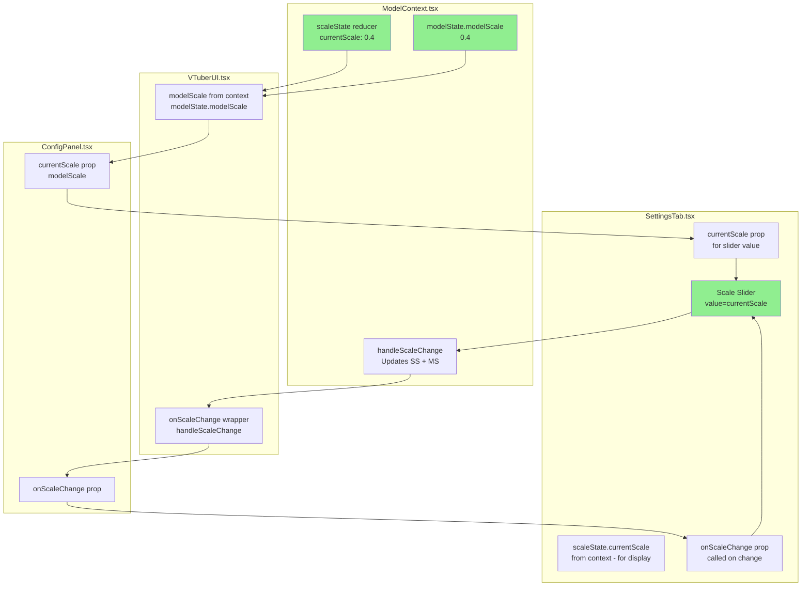
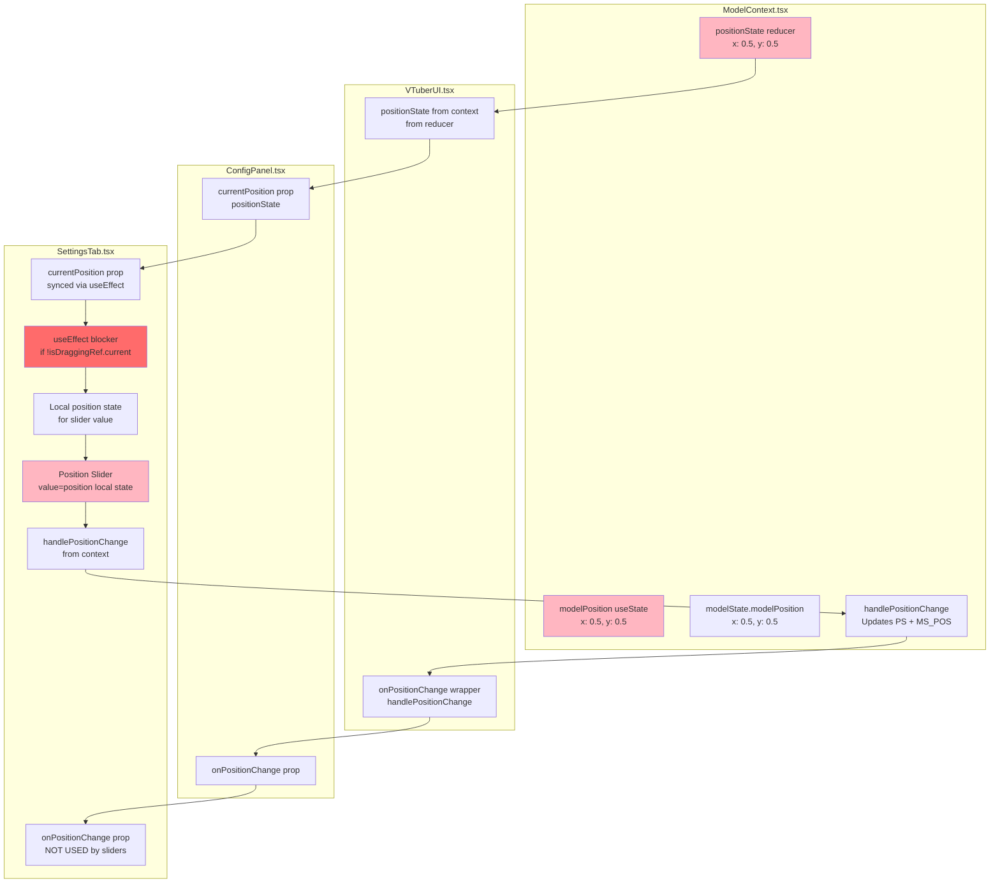
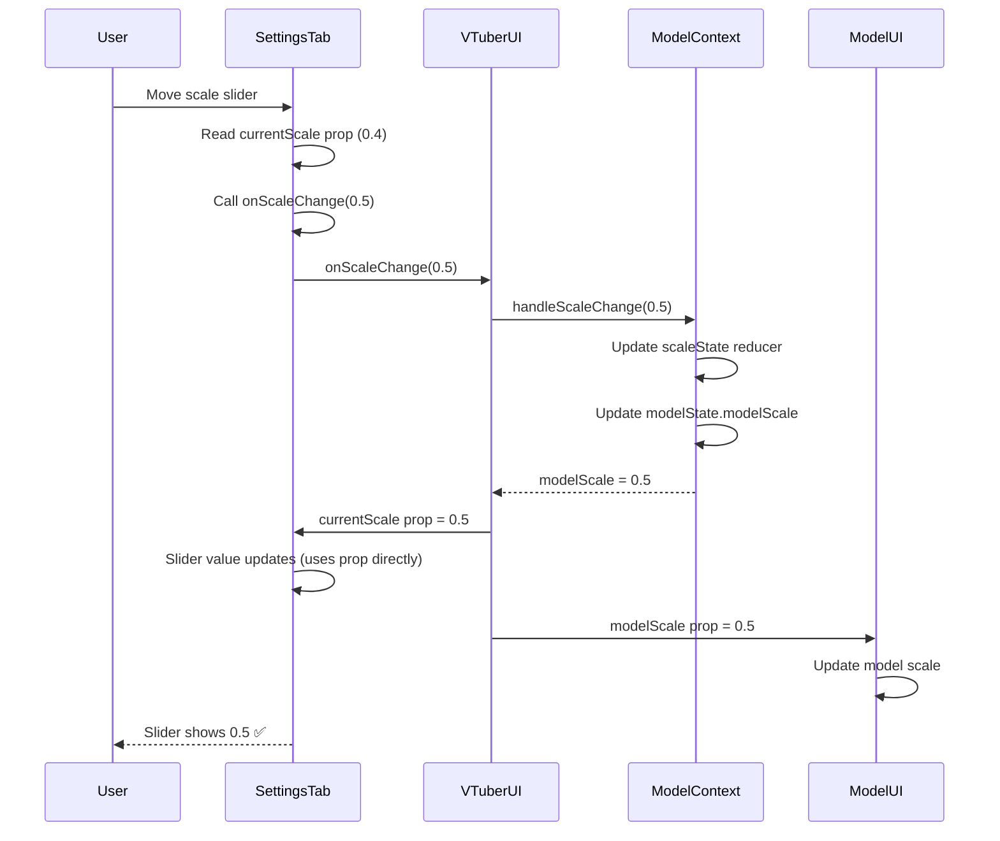
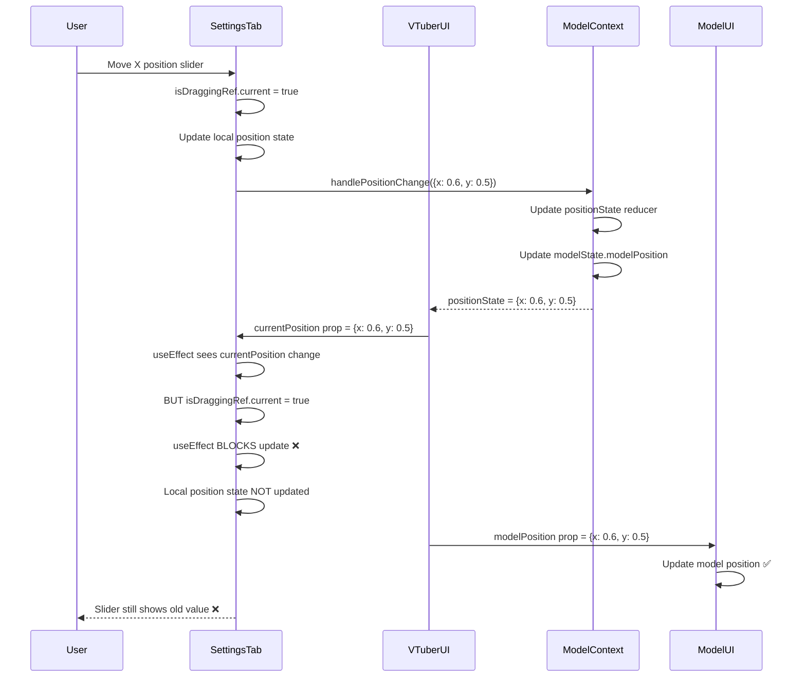

# Position State Flow Analysis

This document describes the complete flow of position state management in the frontend, comparing it with the **working scale implementation** to identify why position changes don't work.

## Executive Summary

**The Problem**: Position sliders in SettingsTab don't update the model position because:
1. SettingsTab calls `handlePositionChange` from context (which works)
2. But the `useEffect` that syncs `currentPosition` prop back to local state **blocks updates during drag** (`if (!isDraggingRef.current)`)
3. The slider uses local `position` state, which doesn't update from props during drag
4. Scale works because it uses `currentScale` prop directly for the slider value, not local state

## Scale Flow (WORKS) - Reference Implementation



### Scale Implementation Details

**ModelContext.tsx** (lines 50, 370-394):
- `scaleState` via `scaleReducer` - single source of truth
- `handleScaleChange` updates BOTH `scaleState` (reducer) AND `modelState.modelScale`
- Both stay in sync

**VTuberUI.tsx** (lines 30, 38, 484-486, 495):
- Gets `modelScale` from `modelState.modelScale` (not from reducer directly)
- Creates wrapper: `onScaleChange={(scale) => { scaleRef.current = scale; handleScaleChange(scale); }}`
- Passes `currentScale={modelScale}` prop

**SettingsTab.tsx** (lines 86-100, 191, 200):
- **Uses `currentScale` PROP directly for slider value** (line 200): `value={currentScale}`
- Calls `onScaleChange` prop (line 97)
- Reads `scaleState.currentScale` from context for display only (line 191)
- **No local state for scale!**

**Why Scale Works**:
- Slider value comes directly from prop (`currentScale`)
- Prop updates immediately when `modelScale` changes in context
- No blocking conditions or local state interference

## Position Flow (BROKEN) - Current Implementation



### Position Implementation Details

**ModelContext.tsx** (lines 53, 56, 354-368):
- `positionState` via `positionReducer` - primary source
- `modelPosition` via `useState` - duplicate state
- `handlePositionChange` updates BOTH `positionState` (reducer) AND `modelState.modelPosition`
- **Problem**: Two separate state systems that can get out of sync

**VTuberUI.tsx** (lines 32, 39, 488-490, 496, 517):
- Gets `positionState` from reducer (line 32)
- Creates wrapper: `onPositionChange={(x, y) => { positionRef.current = { x, y }; handlePositionChange({ x, y }); }}`
- Passes `currentPosition={positionState}` prop (line 496)
- Passes `modelPosition={positionState}` to ModelUI (line 517)

**SettingsTab.tsx** (lines 27, 31, 35, 40-46, 103-118, 120-135, 230, 261):
- **Uses LOCAL `position` state for slider value** (lines 230, 261): `value={position.x}`
- Has `useEffect` that syncs `currentPosition` prop to local state (lines 40-46)
- **BUT**: `useEffect` only updates when `!isDraggingRef.current` (line 41)
- Calls `handlePositionChange` from context directly (lines 114, 131) - NOT the prop!
- `onPositionChange` prop is only used by Reset/Center buttons (lines 153, 339)

**Why Position Doesn't Work**:
1. Slider uses local `position` state, not prop
2. When slider moves, `isDraggingRef.current = true` (line 104, 121)
3. `handlePositionChange` updates context state ✅
4. Context state flows back as `currentPosition` prop ✅
5. **BUT**: `useEffect` ignores prop updates during drag (`if (!isDraggingRef.current)`) ❌
6. Local `position` state never updates from prop during drag ❌
7. Slider value doesn't reflect actual position ❌

## Detailed Component Flow Comparison

### Scale Flow Sequence



### Position Flow Sequence (Current Broken Flow)



## State Locations Comparison

| Aspect | Scale (WORKS) | Position (BROKEN) |
|--------|---------------|-------------------|
| **Context Reducer** | `scaleState` (line 50) | `positionState` (line 53) |
| **Context State** | `modelState.modelScale` (line 114) | `modelState.modelPosition` (line 115) |
| **Duplicate State** | None | `modelPosition` useState (line 56) |
| **VTuberUI Prop** | `currentScale={modelScale}` | `currentPosition={positionState}` |
| **SettingsTab Slider Value** | `value={currentScale}` (prop) ✅ | `value={position.x}` (local state) ❌ |
| **SettingsTab Change Handler** | `onScaleChange` (prop) ✅ | `handlePositionChange` (context) ⚠️ |
| **Sync Mechanism** | Direct prop usage | useEffect with blocker ❌ |
| **Display Value** | `scaleState.currentScale` (context) | Local `position` state |

## Root Cause Analysis

### Primary Issue: Local State vs Prop Usage

**Scale**:
- Slider uses prop directly: `value={currentScale}`
- No local state interference
- Updates flow immediately

**Position**:
- Slider uses local state: `value={position.x}`
- Local state synced via useEffect with condition
- Condition blocks updates during drag

### Secondary Issue: Dual Update Paths

**Scale**:
- Single update path: `onScaleChange` prop → `handleScaleChange` context
- Consistent behavior

**Position**:
- Sliders use: `handlePositionChange` from context
- Buttons use: `onPositionChange` prop
- Two different paths create confusion

### Tertiary Issue: State Duplication

**Scale**:
- Single source: `scaleState` reducer
- `modelState.modelScale` kept in sync

**Position**:
- Two sources: `positionState` reducer AND `modelPosition` useState
- Potential for desync

## The Fix: Make Position Work Like Scale

### Solution 1: Use Prop Directly (Recommended - Matches Scale Pattern)

**Changes Needed**:

1. **SettingsTab.tsx**:
   - Remove local `position` state (line 35)
   - Use `currentPosition` prop directly for slider values (like scale does)
   - Remove the blocking `useEffect` (lines 40-46)
   - Use `onPositionChange` prop for all changes (like scale does)

```typescript
// BEFORE (BROKEN):
const [position, setPosition] = useState<{ x: number; y: number }>(currentPosition);
useEffect(() => {
  if (!isDraggingRef.current) {
    positionRef.current = currentPosition;
    setPosition(currentPosition);
  }
}, [currentPosition]);
// Slider: value={position.x}

// AFTER (WORKS LIKE SCALE):
// No local position state needed
// Slider: value={currentPosition.x}
```

2. **SettingsTab.tsx** - Update handlers:
   - Change `handlePositionXChange` to call `onPositionChange` prop instead of context
   - Change `handlePositionYChange` to call `onPositionChange` prop instead of context
   - Remove `handlePositionChange` from context usage

3. **ModelContext.tsx**:
   - Consider removing duplicate `modelPosition` useState (line 56)
   - Use only `positionState` reducer as single source of truth

### Solution 2: Fix the useEffect Blocker

**Changes Needed**:

1. **SettingsTab.tsx** - Remove blocker condition:
```typescript
// BEFORE:
useEffect(() => {
  if (!isDraggingRef.current) {  // ❌ Blocks updates during drag
    positionRef.current = currentPosition;
    setPosition(currentPosition);
  }
}, [currentPosition]);

// AFTER:
useEffect(() => {
  positionRef.current = currentPosition;
  setPosition(currentPosition);  // Always update
}, [currentPosition]);
```

**Problem with Solution 2**: Still uses local state, which can cause flickering and sync issues. Solution 1 is cleaner.

## Recommended Implementation Pattern

Follow the **Scale Pattern** exactly:

1. **Single source of truth**: Use reducer state only
2. **Direct prop usage**: Slider uses prop value directly
3. **Prop-based updates**: All changes go through prop handler
4. **No local state**: Don't duplicate state in SettingsTab
5. **No blockers**: Don't block prop updates during interaction

## Code Changes Summary

### SettingsTab.tsx Changes

```typescript
// REMOVE:
const [position, setPosition] = useState<{ x: number; y: number }>(currentPosition);
const { scaleState, handlePositionChange } = useModel();  // Remove handlePositionChange
useEffect(() => {
  if (!isDraggingRef.current) {
    positionRef.current = currentPosition;
    setPosition(currentPosition);
  }
}, [currentPosition]);

// ADD:
const { scaleState } = useModel();  // Keep only scaleState

// CHANGE handlers:
const handlePositionXChange = (e: React.ChangeEvent<HTMLInputElement>) => {
  const x = parseFloat(e.target.value);
  const newPosition = { ...currentPosition, x };
  onPositionChange(newPosition.x, newPosition.y);  // Use prop, not context
};

// CHANGE slider:
<input 
  value={currentPosition.x}  // Use prop directly
  onChange={handlePositionXChange}
/>
```

### ModelContext.tsx Changes (Optional - Cleanup)

```typescript
// CONSIDER REMOVING:
const [modelPosition, setModelPosition] = useState<{ x: number; y: number }>({ x: 0.5, y: 0.5 });

// USE ONLY:
const [positionState, positionDispatch] = useReducer(positionReducer, { x: 0.5, y: 0.5 });
```

## Testing Checklist

After implementing the fix:

- [ ] X position slider updates model position immediately
- [ ] Y position slider updates model position immediately
- [ ] Slider value reflects actual position (no drift)
- [ ] Reset button works correctly
- [ ] Center button works correctly
- [ ] Position persists across component remounts
- [ ] No flickering or jitter during drag
- [ ] Position updates match scale behavior

## Conclusion

The position implementation diverged from the working scale pattern by:
1. Using local state instead of prop directly
2. Adding a blocker condition in useEffect
3. Using context handler instead of prop handler

**Fix**: Make position work exactly like scale - use prop directly, no local state, no blockers.
