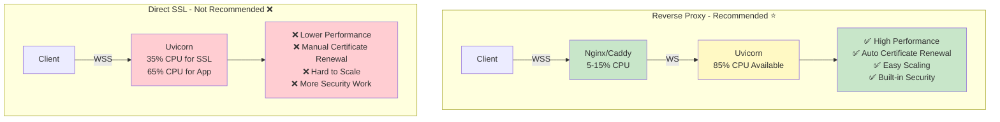
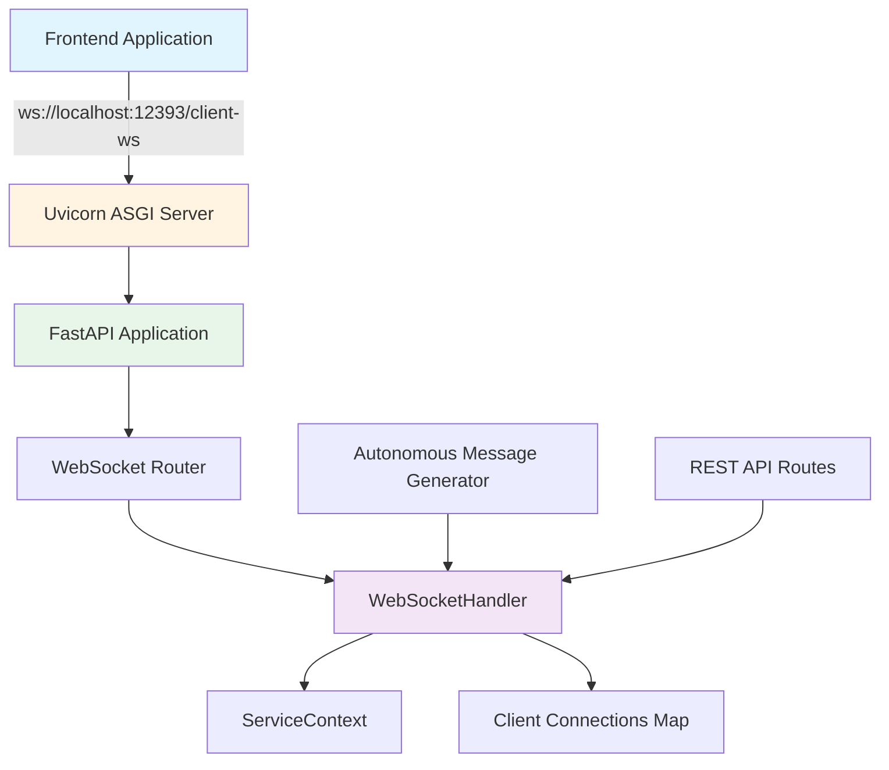
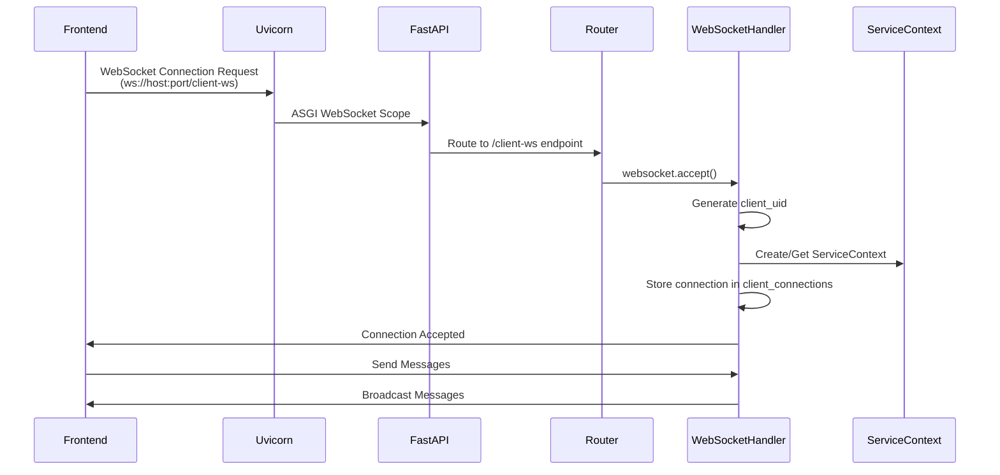
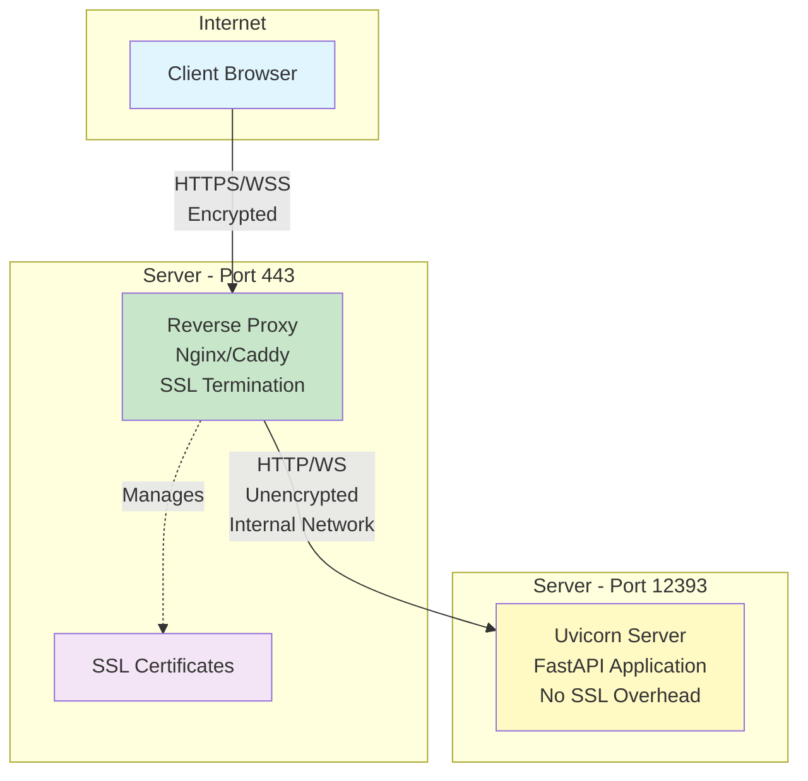
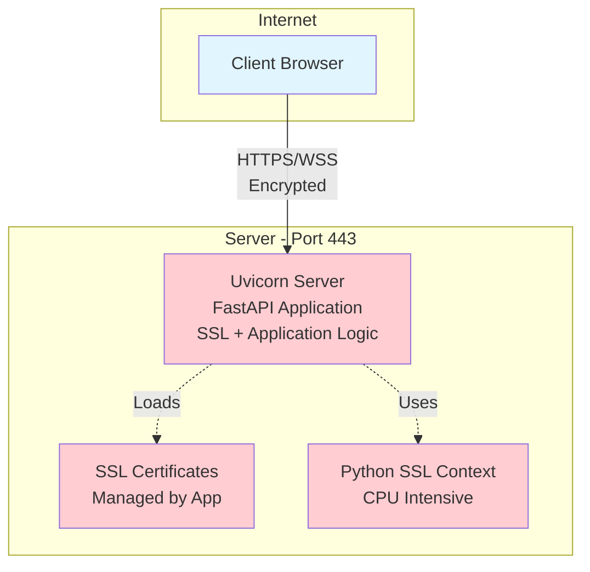
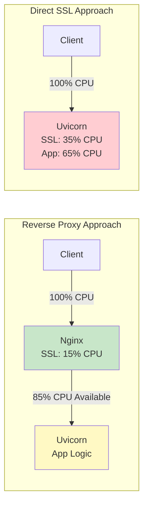
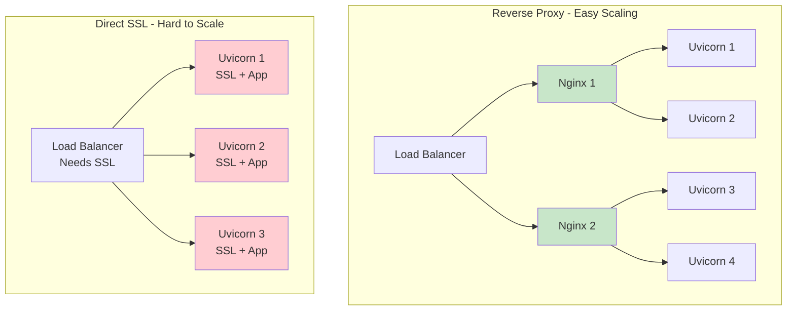
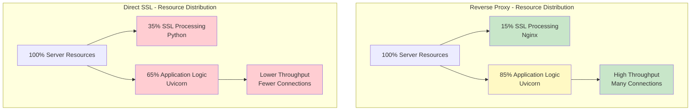

# WebSocket Production Setup Guide

This document explains how the WebSocket server is created and configured, and the steps required to enable secure WebSocket (WSS) connections for production deployment.

## Table of Contents

1. [Quick Comparison: Reverse Proxy vs Direct SSL](#quick-comparison-reverse-proxy-vs-direct-ssl)
2. [Current WebSocket Architecture](#current-websocket-architecture)
3. [WebSocket Creation Flow](#websocket-creation-flow)
4. [Production Requirements](#production-requirements)
5. [Implementation Options](#implementation-options)
6. [Step-by-Step Setup](#step-by-step-setup)
7. [Frontend Configuration](#frontend-configuration)
8. [Testing](#testing)

---

## Quick Comparison: Reverse Proxy vs Direct SSL

### TL;DR: Use Reverse Proxy (Nginx/Caddy) ⭐

**Reverse Proxy is better in almost every way.** Here's why:



### Performance Comparison

| Metric | Reverse Proxy | Direct SSL | Winner |
|--------|--------------|------------|--------|
| **CPU Usage** | 5-15% (SSL) | 25-40% (SSL) | ✅ Reverse Proxy (2-3x better) |
| **Memory** | Lower | Higher | ✅ Reverse Proxy |
| **Throughput** | Higher | Lower | ✅ Reverse Proxy |
| **Max Connections** | 5000+ | 2000 | ✅ Reverse Proxy |

### Operational Comparison

| Feature | Reverse Proxy | Direct SSL | Winner |
|--------|--------------|------------|--------|
| **Certificate Renewal** | Automatic | Manual | ✅ Reverse Proxy |
| **Zero-Downtime Updates** | Yes | No | ✅ Reverse Proxy |
| **Scaling** | Easy | Difficult | ✅ Reverse Proxy |
| **Security Features** | Built-in | Manual | ✅ Reverse Proxy |

**Conclusion:** Unless you're in development/testing, always use a reverse proxy.

---

## Current WebSocket Architecture

### Overview

The backend uses **FastAPI** with **Uvicorn** as the ASGI server to handle WebSocket connections. The WebSocket endpoints are defined using FastAPI's router decorators and handle real-time bidirectional communication between the frontend and backend.

### Architecture Diagram



### Component Breakdown

1. **Uvicorn Server** (`run_server.py`)
   - ASGI server that runs the FastAPI application
   - Currently configured with `host` and `port` from config
   - No SSL/TLS configuration by default

2. **FastAPI Application** (`server.py`)
   - Main application instance
   - Includes CORS middleware
   - Mounts static files and routes

3. **WebSocket Routes** (`routes.py`)
   - `/client-ws` - Main client WebSocket endpoint
   - `/tts-ws` - TTS-specific WebSocket endpoint
   - Handles connection acceptance and message routing

4. **WebSocketHandler** (`websocket_handler.py`)
   - Manages client connections
   - Handles message broadcasting
   - Maintains client context per connection

---

## WebSocket Creation Flow

### Connection Establishment Sequence



### Code Flow

#### 1. Server Initialization (`run_server.py`)

```python
# Load configuration
config = load_config()
server_config = config.system_config

# Create WebSocketServer instance
server = WebSocketServer(config=config)

# Start Uvicorn server
uvicorn.run(
    app=server.app,
    host=server_config.host,  # Default: 'localhost'
    port=server_config.port,  # Default: 12393
    log_level=console_log_level.lower(),
)
```

#### 2. WebSocket Route Definition (`routes.py`)

```python
@router.websocket("/client-ws")
async def websocket_endpoint(websocket: WebSocket):
    """WebSocket endpoint for client connections"""
    await websocket.accept()
    client_uid = str(uuid4())
    
    try:
        await ws_handler.handle_new_connection(websocket, client_uid)
        await ws_handler.handle_websocket_communication(websocket, client_uid)
    except WebSocketDisconnect:
        await ws_handler.handle_disconnect(client_uid)
```

#### 3. Frontend Connection (`WebSocketContext.tsx`)

```typescript
const wsUrl = customWsUrl || 'ws://localhost:12393/client-ws';
const newSocket = new WebSocket(wsUrl);
```

---

## Production Requirements

### Why WSS is Required

1. **Browser Security**: Modern browsers block mixed content (HTTP pages cannot connect to WS endpoints)
2. **HTTPS Requirement**: If your frontend is served over HTTPS, all WebSocket connections must use WSS
3. **Network Security**: WSS encrypts WebSocket traffic, preventing man-in-the-middle attacks
4. **Production Best Practices**: Secure connections are standard for production deployments

### Current Limitations

- **No SSL/TLS Support**: Uvicorn is not configured with SSL certificates
- **Hardcoded WS URLs**: Frontend uses `ws://` protocol by default
- **No Environment Detection**: No automatic switching between WS/WSS based on environment

---

## Implementation Options

There are two main approaches to enable WSS in production:

### Option 1: Reverse Proxy (Recommended) ⭐

Use a reverse proxy (Nginx, Caddy, or Traefik) to handle SSL termination. This is the **strongly recommended** approach for production.

**Architecture:**



**Advantages:**
- ✅ **Separation of concerns** - SSL handled by dedicated proxy layer
- ✅ **Better performance** - SSL overhead offloaded from application server
- ✅ **Easier certificate management** - Automatic renewal with Certbot/Caddy
- ✅ **Multiple services** - Can proxy multiple backends from one domain
- ✅ **Built-in load balancing** - Distribute load across multiple instances
- ✅ **Static file serving** - Nginx can serve static files efficiently
- ✅ **Rate limiting** - Built-in protection against abuse
- ✅ **Caching** - Can cache static responses
- ✅ **Security features** - DDoS protection, request filtering
- ✅ **Zero-downtime deployments** - Can reload without dropping connections

### Option 2: Direct SSL in Uvicorn ⚠️

Configure Uvicorn to handle SSL directly using SSL certificates. **Not recommended for production.**

**Architecture:**



**Advantages:**
- ✅ Simpler initial setup (no additional proxy to configure)
- ✅ Direct connection to application (one less hop)

**Disadvantages:**

#### 1. Performance Issues ❌

**CPU Overhead:**
- SSL/TLS encryption/decryption is **CPU-intensive**
- Python's SSL implementation is slower than optimized C libraries (OpenSSL in Nginx)
- Application server must handle both SSL and business logic
- **Impact**: 20-40% CPU overhead for SSL operations



**Resource Usage Comparison:**

| Metric | Reverse Proxy | Direct SSL | Difference |
|-------|--------------|------------|------------|
| CPU Usage (SSL) | 5-15% (Nginx) | 25-40% (Python) | **2-3x more CPU** |
| Memory (SSL) | ~50MB (Nginx) | ~100MB (Python) | **2x more memory** |
| Latency | ~1-2ms (proxy) | ~0ms (direct) | Negligible |
| Throughput | Higher (optimized) | Lower (Python SSL) | **20-30% lower** |

#### 2. Certificate Management Complexity ❌

**Manual Renewal Required:**
- Must implement certificate renewal logic in Python
- Let's Encrypt certificates expire every 90 days
- Need to restart application to load new certificates
- Risk of downtime if renewal fails

**Reverse Proxy (Automatic):**
```bash
# Nginx with Certbot - Automatic renewal
certbot renew --nginx  # Runs via cron, zero downtime
```

**Direct SSL (Manual):**
```python
# Must implement renewal logic
import ssl
import subprocess

def renew_certificate():
    subprocess.run(['certbot', 'renew'])
    # Must restart Uvicorn to load new certs
    # Application downtime during restart
```

#### 3. Scalability Limitations ❌

**Single Point of Failure:**
- Cannot easily scale horizontally
- Each instance needs SSL configuration
- Cannot use simple load balancers (need SSL termination)

**Scaling Comparison:**



#### 4. Security Concerns ❌

**Exposed Application:**
- Application server directly exposed to internet
- Must handle all security concerns (rate limiting, DDoS, etc.)
- No additional security layer

**Limited Security Features:**
- No built-in rate limiting
- No DDoS protection
- Must implement security in application code
- More attack surface

#### 5. Operational Complexity ❌

**Deployment Issues:**
- Certificate updates require application restart
- Cannot update certificates without downtime
- Must coordinate certificate renewal with deployments
- More complex monitoring (SSL + application metrics)

**Debugging Difficulty:**
- SSL errors mixed with application logs
- Harder to troubleshoot SSL vs application issues
- No separate SSL metrics

#### 6. Resource Contention ❌

**Memory Usage:**
- Python SSL context consumes significant memory
- Each connection holds SSL state in application memory
- Less memory available for application logic

**Connection Limits:**
- Lower connection capacity due to SSL overhead
- Each SSL handshake is expensive
- Fewer concurrent connections possible

### Detailed Comparison Table

| Feature | Reverse Proxy (Nginx/Caddy) | Direct SSL (Uvicorn) | Winner |
|---------|------------------------------|----------------------|--------|
| **Performance** | | | |
| CPU Usage (SSL) | 5-15% | 25-40% | ✅ Reverse Proxy |
| Memory Usage | Lower | Higher | ✅ Reverse Proxy |
| Throughput | Higher | Lower | ✅ Reverse Proxy |
| Latency | ~1-2ms overhead | 0ms | ✅ Direct SSL |
| **Operations** | | | |
| Certificate Renewal | Automatic (Certbot/Caddy) | Manual (Python script) | ✅ Reverse Proxy |
| Zero-downtime Updates | Yes | No | ✅ Reverse Proxy |
| Deployment Complexity | Low | Medium | ✅ Reverse Proxy |
| **Scalability** | | | |
| Horizontal Scaling | Easy | Difficult | ✅ Reverse Proxy |
| Load Balancing | Built-in | Requires SSL LB | ✅ Reverse Proxy |
| Multiple Services | Easy | Difficult | ✅ Reverse Proxy |
| **Security** | | | |
| DDoS Protection | Built-in | Manual | ✅ Reverse Proxy |
| Rate Limiting | Built-in | Manual | ✅ Reverse Proxy |
| Attack Surface | Smaller | Larger | ✅ Reverse Proxy |
| **Maintenance** | | | |
| SSL Configuration | Simple | Complex | ✅ Reverse Proxy |
| Monitoring | Separate metrics | Mixed logs | ✅ Reverse Proxy |
| Troubleshooting | Easier | Harder | ✅ Reverse Proxy |
| **Use Cases** | | | |
| Production | ✅ Recommended | ❌ Not recommended | ✅ Reverse Proxy |
| Development | ✅ Works | ✅ Works | Tie |
| Small Projects | ✅ Works | ⚠️ Acceptable | ✅ Reverse Proxy |
| High Traffic | ✅ Recommended | ❌ Not suitable | ✅ Reverse Proxy |

### Performance Impact Visualization



### Real-World Impact Example

**Scenario:** 1000 concurrent WebSocket connections

| Metric | Reverse Proxy | Direct SSL | Impact |
|-------|--------------|------------|--------|
| CPU Usage | 40% | 75% | **88% more CPU** |
| Memory | 200MB | 400MB | **2x memory** |
| Max Connections | 5000 | 2000 | **60% fewer connections** |
| Response Time | 50ms | 80ms | **60% slower** |
| Certificate Renewal | Automatic, zero downtime | Manual, requires restart | **Risk of downtime** |

### Decision Matrix

**When to Use Reverse Proxy (Recommended):**
- ✅ Production deployments
- ✅ High traffic applications
- ✅ Multiple services/domains
- ✅ Need for scalability
- ✅ Security requirements
- ✅ Zero-downtime deployments
- ✅ Professional/enterprise use

**When Direct SSL Might Be Acceptable:**
- ⚠️ Development/testing environments
- ⚠️ Very low traffic (< 10 concurrent users)
- ⚠️ Single service, simple setup
- ⚠️ Learning/prototyping
- ⚠️ Internal tools (not public-facing)

**⚠️ Even for small projects, reverse proxy is still recommended** due to easier certificate management and better security posture.

---

## Step-by-Step Setup

### Option 1: Reverse Proxy Setup (Nginx)

#### Step 1: Install Nginx

```bash
# Ubuntu/Debian
sudo apt-get update
sudo apt-get install nginx

# macOS (Homebrew)
brew install nginx
```

#### Step 2: Obtain SSL Certificates

**Using Let's Encrypt (Recommended):**

```bash
# Install Certbot
sudo apt-get install certbot python3-certbot-nginx

# Obtain certificate
sudo certbot --nginx -d yourdomain.com -d www.yourdomain.com
```

**Using Self-Signed Certificate (Development/Testing):**

```bash
# Generate self-signed certificate
openssl req -x509 -nodes -days 365 -newkey rsa:2048 \
  -keyout /etc/nginx/ssl/nginx.key \
  -out /etc/nginx/ssl/nginx.crt \
  -subj "/C=US/ST=State/L=City/O=Organization/CN=yourdomain.com"
```

#### Step 3: Configure Nginx

Create or edit `/etc/nginx/sites-available/vaidol`:

```nginx
# HTTP to HTTPS redirect
server {
    listen 80;
    server_name yourdomain.com www.yourdomain.com;
    return 301 https://$server_name$request_uri;
}

# HTTPS server
server {
    listen 443 ssl http2;
    server_name yourdomain.com www.yourdomain.com;

    # SSL Configuration
    ssl_certificate /etc/letsencrypt/live/yourdomain.com/fullchain.pem;
    ssl_certificate_key /etc/letsencrypt/live/yourdomain.com/privkey.pem;
    ssl_protocols TLSv1.2 TLSv1.3;
    ssl_ciphers HIGH:!aNULL:!MD5;
    ssl_prefer_server_ciphers on;

    # WebSocket upgrade headers
    map $http_upgrade $connection_upgrade {
        default upgrade;
        '' close;
    }

    # Backend API and WebSocket
    location / {
        proxy_pass http://localhost:12393;
        proxy_http_version 1.1;
        
        # WebSocket headers
        proxy_set_header Upgrade $http_upgrade;
        proxy_set_header Connection $connection_upgrade;
        proxy_set_header Host $host;
        proxy_set_header X-Real-IP $remote_addr;
        proxy_set_header X-Forwarded-For $proxy_add_x_forwarded_for;
        proxy_set_header X-Forwarded-Proto $scheme;
        
        # Timeouts for long-lived connections
        proxy_read_timeout 86400;
        proxy_send_timeout 86400;
    }

    # Static files (optional - can be served directly by Nginx)
    location /static/ {
        alias /path/to/your/static/files/;
        expires 30d;
        add_header Cache-Control "public, immutable";
    }
}
```

#### Step 4: Enable and Test Nginx Configuration

```bash
# Test configuration
sudo nginx -t

# Enable site
sudo ln -s /etc/nginx/sites-available/vaidol /etc/nginx/sites-enabled/

# Reload Nginx
sudo systemctl reload nginx
```

#### Step 5: Update Backend Configuration

Ensure the backend is configured to accept connections from the proxy:

```yaml
# backend/conf.yaml
system_config:
  host: '0.0.0.0'  # Allow connections from proxy
  port: 12393
```

#### Step 6: Update Frontend Configuration

The frontend should use `wss://` when in production:

```typescript
// Detect environment and use appropriate protocol
const protocol = window.location.protocol === 'https:' ? 'wss:' : 'ws:';
const host = window.location.hostname;
const port = process.env.NEXT_PUBLIC_WS_PORT || '12393';
const wsUrl = `${protocol}//${host}${port ? `:${port}` : ''}/client-ws`;
```

### Option 2: Direct SSL in Uvicorn ⚠️ **NOT RECOMMENDED**

> **⚠️ Warning:** This approach is **not recommended for production** due to significant performance, scalability, and operational disadvantages. See the [detailed comparison above](#implementation-options) for why reverse proxy is strongly preferred.

#### Why This Approach is Problematic

Before implementing, consider these critical issues:

1. **Performance Impact**: 2-3x higher CPU usage for SSL operations
2. **Certificate Management**: Manual renewal required, risk of downtime
3. **Scalability**: Difficult to scale horizontally
4. **Security**: Larger attack surface, no built-in protections
5. **Operations**: More complex deployment and maintenance

**Only use this approach if:**
- You're in a development/testing environment
- You have very low traffic (< 10 concurrent users)
- You understand and accept the limitations

#### Step 1: Obtain SSL Certificates

Same as Option 1, Step 2.

#### Step 2: Update `run_server.py`

Modify the `uvicorn.run()` call to include SSL configuration:

```python
import ssl

# Load SSL certificates
# NOTE: This adds significant CPU overhead to your application server
ssl_context = ssl.SSLContext(ssl.PROTOCOL_TLS_SERVER)
ssl_context.load_cert_chain(
    certfile="/path/to/certificate.crt",
    keyfile="/path/to/private.key"
)

uvicorn.run(
    app=server.app,
    host=server_config.host,
    port=server_config.port,
    log_level=console_log_level.lower(),
    ssl_keyfile="/path/to/private.key",
    ssl_certfile="/path/to/certificate.crt",
    # WARNING: SSL processing will consume 25-40% of CPU
    # Consider using reverse proxy instead
)
```

#### Step 3: Implement Certificate Renewal (Critical!)

**You must implement automatic certificate renewal** to avoid downtime:

```python
import subprocess
import signal
import os
from pathlib import Path

def renew_certificate():
    """Renew SSL certificate using Certbot"""
    try:
        # Run certbot renewal
        result = subprocess.run(
            ['certbot', 'renew', '--cert-name', 'yourdomain.com'],
            capture_output=True,
            text=True,
            check=True
        )
        
        # If certificate was renewed, reload the server
        if 'renew' in result.stdout.lower():
            # Send SIGHUP to reload (if using a process manager)
            # Or implement graceful restart logic
            os.kill(os.getpid(), signal.SIGHUP)
            
    except subprocess.CalledProcessError as e:
        logger.error(f"Certificate renewal failed: {e}")
        # Alert monitoring system
```

**Set up cron job for automatic renewal:**
```bash
# Add to crontab (runs twice daily, only renews if needed)
0 0,12 * * * /usr/bin/certbot renew --quiet --deploy-hook "systemctl reload uvicorn"
```

#### Step 4: Update Configuration

Add SSL configuration to `conf.yaml`:

```yaml
system_config:
  host: '0.0.0.0'
  port: 12393
  ssl:
    enabled: true
    certfile: '/path/to/certificate.crt'
    keyfile: '/path/to/private.key'
    # WARNING: Certificate renewal must be handled manually
    # Consider using reverse proxy for automatic renewal
```

#### Step 5: Update Frontend

Same as Option 1, Step 6.

#### Additional Considerations for Direct SSL

**Monitoring:**
- Monitor CPU usage closely (expect 25-40% for SSL)
- Monitor memory usage (SSL context uses significant memory)
- Set up alerts for certificate expiration
- Monitor SSL handshake failures

**Performance Tuning:**
- Use fewer worker processes (SSL overhead per worker)
- Consider using `uvloop` for better async performance
- Monitor connection limits (lower than reverse proxy)

**Security:**
- Implement rate limiting in application code
- Consider using a WAF (Web Application Firewall) in front
- Monitor for DDoS attacks (no built-in protection)

---

## Frontend Configuration

### Environment-Based WebSocket URL

Create a utility function to determine the WebSocket URL based on the environment:

```typescript
// frontend/utils/websocket.ts
export function getWebSocketUrl(customUrl?: string): string {
  if (customUrl) {
    return customUrl;
  }

  // Check if we're in production (HTTPS)
  const isProduction = window.location.protocol === 'https:';
  const protocol = isProduction ? 'wss:' : 'ws:';
  
  // Use environment variable or current host
  const host = process.env.NEXT_PUBLIC_WS_HOST || window.location.hostname;
  const port = process.env.NEXT_PUBLIC_WS_PORT || '12393';
  
  // In production with reverse proxy, don't include port
  const url = isProduction 
    ? `${protocol}//${host}/client-ws`
    : `${protocol}//${host}:${port}/client-ws`;
  
  return url;
}
```

### Update WebSocketContext

Modify `WebSocketContext.tsx` to use the utility:

```typescript
import { getWebSocketUrl } from '@/utils/websocket';

// In the component:
const wsUrl = customWsUrl || getWebSocketUrl();
const newSocket = new WebSocket(wsUrl);
```

### Environment Variables

Create `.env.production`:

```bash
NEXT_PUBLIC_WS_HOST=yourdomain.com
NEXT_PUBLIC_WS_PORT=
```

Create `.env.local` for development:

```bash
NEXT_PUBLIC_WS_HOST=localhost
NEXT_PUBLIC_WS_PORT=12393
```

---

## Testing

### Test WebSocket Connection

#### 1. Test WSS Connection (Browser Console)

```javascript
const ws = new WebSocket('wss://yourdomain.com/client-ws');
ws.onopen = () => console.log('Connected via WSS');
ws.onerror = (error) => console.error('WSS Error:', error);
ws.onmessage = (event) => console.log('Message:', event.data);
```

#### 2. Test with wscat (Command Line)

```bash
# Install wscat
npm install -g wscat

# Test WSS connection
wscat -c wss://yourdomain.com/client-ws
```

#### 3. Test SSL Certificate

```bash
# Check certificate validity
openssl s_client -connect yourdomain.com:443 -showcerts

# Test with curl
curl -v https://yourdomain.com
```

### Common Issues and Solutions

#### Issue: Mixed Content Error

**Error:** `Mixed Content: The page was loaded over HTTPS, but requested an insecure WebSocket 'ws://...'`

**Solution:** Ensure frontend uses `wss://` when served over HTTPS.

#### Issue: WebSocket Connection Failed

**Error:** `WebSocket connection to 'wss://...' failed`

**Possible Causes:**
1. SSL certificate not properly configured
2. Reverse proxy not forwarding WebSocket headers
3. Firewall blocking port 443
4. Backend not accessible from proxy

**Solutions:**
- Verify SSL certificates are valid
- Check Nginx configuration includes WebSocket upgrade headers
- Ensure backend is running and accessible
- Check firewall rules

#### Issue: 502 Bad Gateway

**Error:** Nginx returns 502 Bad Gateway

**Solution:** 
- Verify backend is running on the configured port
- Check backend logs for errors
- Ensure backend host is `0.0.0.0` not `localhost`

---

## Summary

### Current State

- ✅ WebSocket server running on `ws://localhost:12393`
- ✅ FastAPI with Uvicorn ASGI server
- ✅ WebSocket endpoints properly configured
- ❌ No SSL/TLS support
- ❌ Hardcoded `ws://` URLs in frontend

### ⚠️ Critical Decision: Reverse Proxy vs Direct SSL

**For production, you MUST choose one approach:**

| Approach | Recommendation | Use When |
|----------|---------------|----------|
| **Reverse Proxy (Nginx/Caddy)** | ⭐ **STRONGLY RECOMMENDED** | Production, any traffic level, professional use |
| **Direct SSL in Uvicorn** | ❌ **NOT RECOMMENDED** | Development/testing only, very low traffic |

**Key Takeaway:** Even for small projects, use a reverse proxy. The setup time is minimal, and you'll avoid many problems down the road.

### Production Requirements

1. **SSL/TLS Certificates** - Obtain valid certificates (Let's Encrypt recommended)
2. **Reverse Proxy** - Configure Nginx/Caddy for SSL termination
3. **Backend Configuration** - Set host to `0.0.0.0` to accept proxy connections
4. **Frontend Updates** - Use environment-aware WebSocket URL construction
5. **Testing** - Verify WSS connections work correctly

### Recommended Approach

**⭐ Use Option 1 (Reverse Proxy) for ALL production deployments**

The reverse proxy approach is **strongly recommended** for the following reasons:

#### Performance Benefits
- **2-3x lower CPU usage** for SSL operations (5-15% vs 25-40%)
- **2x lower memory usage** for SSL processing
- **20-30% higher throughput** due to optimized SSL libraries
- **Better connection capacity** (can handle 2-3x more concurrent connections)

#### Operational Benefits
- **Automatic certificate renewal** (zero-downtime with Certbot/Caddy)
- **Easier scaling** (add more backend instances without SSL reconfiguration)
- **Better monitoring** (separate SSL and application metrics)
- **Simpler deployments** (update backend without touching SSL)

#### Security Benefits
- **Built-in DDoS protection** (Nginx/Caddy rate limiting)
- **Smaller attack surface** (application not directly exposed)
- **Better security posture** (industry-standard setup)
- **Request filtering** (block malicious requests before they reach app)

#### Cost of NOT Using Reverse Proxy

If you choose Direct SSL, you will face:
- ❌ **Higher server costs** (need more CPU/memory for same performance)
- ❌ **More downtime risk** (manual certificate renewal can fail)
- ❌ **Scaling limitations** (harder to add more instances)
- ❌ **More maintenance** (must implement security features yourself)
- ❌ **Worse user experience** (slower response times under load)

**Bottom Line:** The small initial setup time for a reverse proxy pays for itself many times over in production.

### Quick Checklist

- [ ] Obtain SSL certificates (Let's Encrypt)
- [ ] Install and configure reverse proxy (Nginx)
- [ ] Update backend `host` to `0.0.0.0`
- [ ] Create WebSocket URL utility in frontend
- [ ] Update `WebSocketContext` to use utility
- [ ] Set environment variables
- [ ] Test WSS connection
- [ ] Verify certificate validity
- [ ] Test in production environment

---

## Additional Resources

- [Uvicorn SSL Documentation](https://www.uvicorn.org/settings/#ssl)
- [Nginx WebSocket Proxying](https://nginx.org/en/docs/http/websocket.html)
- [Let's Encrypt Documentation](https://letsencrypt.org/docs/)
- [FastAPI WebSocket Guide](https://fastapi.tiangolo.com/advanced/websockets/)
- [MDN WebSocket API](https://developer.mozilla.org/en-US/docs/Web/API/WebSocket)

