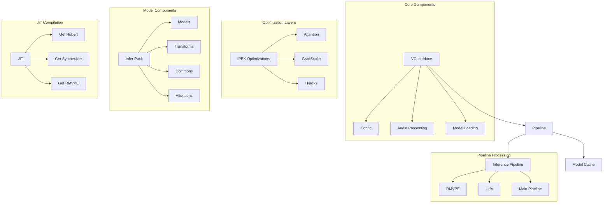

# RVC (Retrieval-based Voice Conversion) System

This package provides a high-performance implementation of Retrieval-based Voice Conversion (RVC) with optimized inference capabilities. It's designed to handle multiple instances in memory simultaneously and includes the latest pitch estimator RMVPE.

## System Architecture



## Key Components

### 1. Core Interface (`interface.py`)
- Main entry point for voice conversion
- Handles model loading and inference
- Manages audio processing pipeline

### 2. Pipeline System (`pipeline/`)
- Orchestrates the voice conversion process
- Implements efficient model caching
- Handles RMVPE pitch estimation

### 3. Optimization Layers (`ipex/`)
- Intel PyTorch Extensions optimizations
- Custom attention mechanisms
- Gradient scaling optimizations
- Runtime optimizations through hijacks

### 4. Model Components (`infer_pack/`)
- Core model architectures
- Transform operations
- Common utilities
- Attention mechanisms

### 5. JIT Compilation (`jit/`)
- Just-In-Time compilation for performance
- Hubert model optimization
- Synthesizer optimization
- RMVPE optimization

## Performance Optimizations

1. **Model Caching**
   - Efficient memory management
   - Reduced model loading times
   - Shared model instances

2. **JIT Compilation**
   - Optimized model execution
   - Reduced inference time
   - Hardware-specific optimizations

3. **IPEX Optimizations**
   - Intel-specific optimizations
   - Custom attention mechanisms
   - Efficient gradient scaling

4. **Pipeline Optimizations**
   - Parallel processing capabilities
   - Efficient audio processing
   - Optimized pitch estimation

## Usage

```python
from open_llm_vtuber.rvc.inferrvc import VC

# Initialize the voice conversion system
vc = VC()

# Load a model
n_spk, protect, index = vc.get_vc("path_to_model")

# Perform voice conversion
tgt_sr, audio_opt, times, info = vc.vc_inference(
    sid=0,
    input_audio_path="input.wav",
    f0_method="rmvpe",
    index_rate=0.75
)
```

## Environment Variables

- `RVC_OUTPUTFREQ`: Output frequency (default: 44100)
- `RVC_RETURNBLOCKING`: Return blocking behavior (default: False)
- `rmvpe_root`: Path to RMVPE assets
- `hubert_path`: Path to HuBERT model

## Performance Tips

1. Use model caching for multiple conversions
2. Enable JIT compilation for faster inference
3. Utilize IPEX optimizations on supported hardware
4. Batch process audio files when possible
5. Monitor memory usage with multiple instances

## Dependencies

- PyTorch
- Fairseq
- SoundFile
- NumPy
- Intel PyTorch Extensions (IPEX)

## License

This project is part of the Open-LLM-VTuber project and follows its licensing terms. 